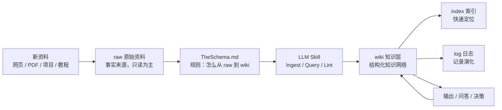
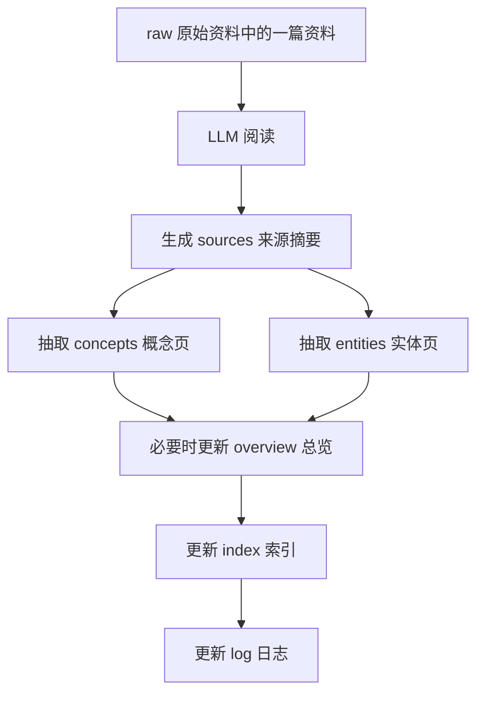
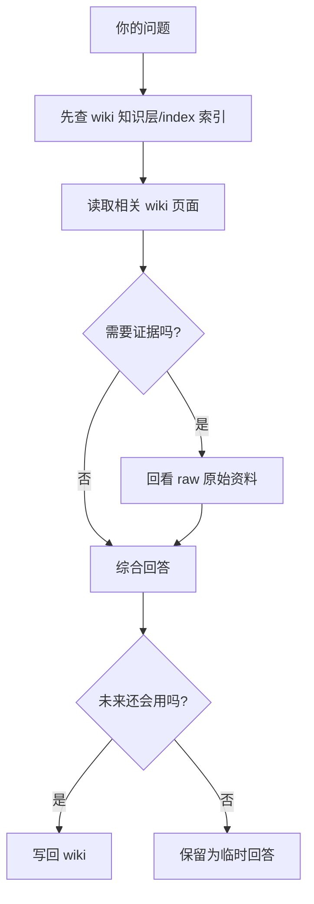
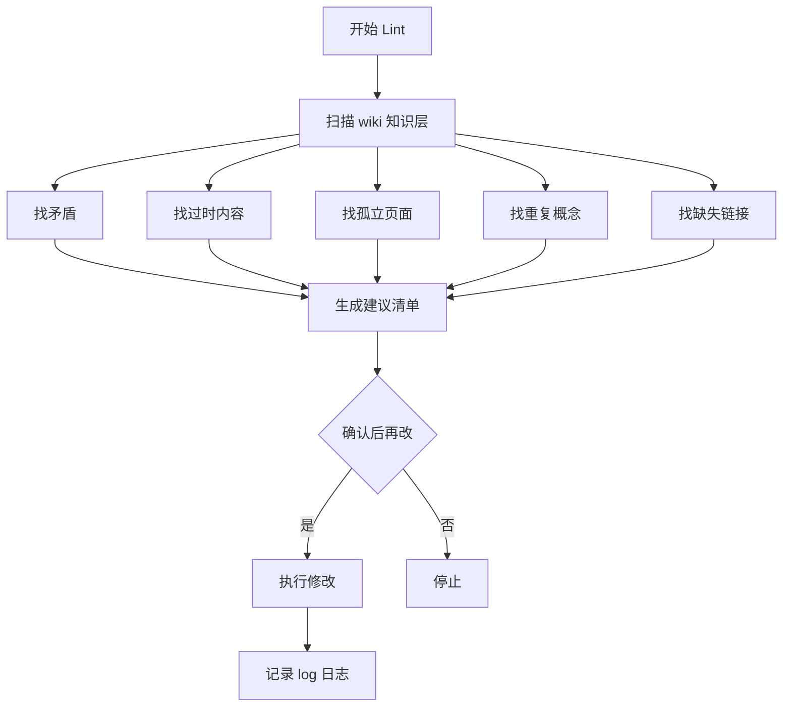

# LLM Wiki 知识库工作流 Skill

> [!summary]
> 这个 Skill 用来维护你的三层知识库：`raw 原始资料/` 存事实，`wiki 知识层/` 存理解，`TheSchema.md` 定规则。

## 1. 什么时候调用

当你想做这些事时，就调用这个工作流：

- 把一篇 raw 资料整理成 wiki
- 基于 wiki 回答问题
- 对 wiki 做健康检查
- 更新 index / log
- 把临时回答沉淀成长期知识页

## 2. 总流程图



## 3. Ingest 摄取流程



你可以这样说：

```text
请基于 raw 原始资料/clippings 网页剪藏/xxx.md 进行 Ingest
```

## 4. Query 问答流程



你可以这样说：

```text
基于 wiki 知识层，回答我：xxx
```

## 5. Lint 审查流程



你可以这样说：

```text
请对 wiki 知识层做一次 Lint，先给建议清单，不要直接大改
```

## 6. 目录对应关系

| 层级 | 目录 | 作用 |
|---|---|---|
| 原始资料层 | [[raw 原始资料/index 索引]] | 保存事实来源 |
| 知识层 | [[wiki 知识层/index 索引]] | 保存结构化理解 |
| 配置层 | [[TheSchema]] | 定义规则和工作流 |
| 附件层 | [[Attachments 附件/附件索引]] | 图片、SVG、媒体资源 |

## 7. 使用口诀

```text
资料先进 raw
理解沉到 wiki
规则看 TheSchema
查找看 index
变化写 log
定期做 Lint
```

## 8. 对应的真实 Agent Skill

这个说明页对应本地 Agent Skill：

```text
.agents/skills/obsidian-knowledge-system/SKILL.md
```
