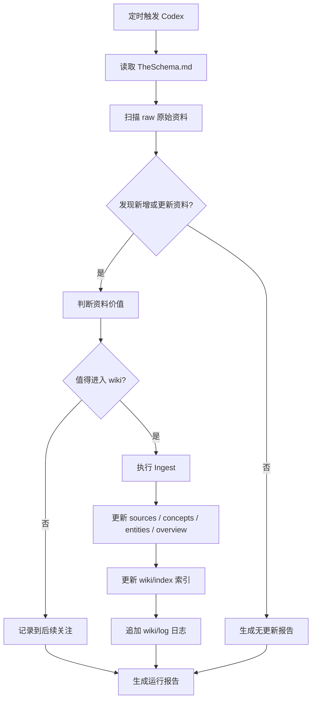

# 自动更新知识库

> [!summary]
> 这是给 Codex 定时自动化任务使用的工作流。目标是：扫描 `raw 原始资料/` 的新增或变化内容，自动整理到 `wiki 知识层/`，并维护 `index 索引` 与 `log 日志`。

## 1. 推荐运行频率

- 每周一次：建议周日晚上或周一上午
- 任务名称：`自动更新知识库`
- 项目：`Obsidian Vault`

## 2. 可直接复制到 Codex 自动化的 Prompt

```text
## 自动更新知识库

你的任务不是简单总结，而是按照“LLM Wiki 三层结构”对我的 Obsidian 知识库做一次增量维护。

## 当前知识库结构

请优先遵守：

- TheSchema.md：系统规则与工作流
- raw 原始资料/：原始资料层，只读为主
- wiki 知识层/：结构化知识层，由 AI 维护
- wiki 知识层/index 索引.md：知识入口索引
- wiki 知识层/log 日志.md：操作日志
- ai有关的装备/skills/LLM Wiki 知识库工作流 Skill.md：工作流说明

## 本次自动化目标

每次运行时，请完成以下事情：

1. 扫描 raw 原始资料/ 中最近新增或更新的 Markdown 文件。
2. 判断哪些资料值得进入 wiki 知识层。
3. 对高价值资料执行 Ingest：
   - 在 wiki 知识层/sources 来源摘要/ 中创建或更新来源摘要页。
   - 必要时创建或更新 wiki 知识层/concepts 概念页/。
   - 必要时创建或更新 wiki 知识层/entities 实体页/。
   - 必要时创建或更新 wiki 知识层/comparisons 比较分析/ 或 wiki 知识层/overview 总览综合/。
4. 更新 wiki 知识层/index 索引.md。
5. 追加 wiki 知识层/log 日志.md。
6. 生成一份本次自动化运行报告，保存到：
   ai有关的装备/workflow工作流/自动化运行记录/YYYY-MM-DD.md

## 扫描优先级

优先扫描这些位置：

1. raw 原始资料/clippings 网页剪藏/
2. raw 原始资料/projects 项目资料/
3. raw 原始资料/tutorials 教程/
4. raw 原始资料/references 参考资料/
5. raw 原始资料/papers 论文文章/
6. raw 原始资料/books 书籍摘录/

跳过这些内容：

- .obsidian/
- .agents/
- .claude/
- .claudian/
- .smart-env/
- node_modules/
- .venv/
- __pycache__/
- 图片、二进制文件、日志文件，除非它们被 Markdown 明确引用

## 判断资料是否值得 Ingest

满足任意一条即可进入 wiki：

- 未来 30 天内可能再次用到
- 能帮助我学习、项目、副业或知识系统建设
- 能形成概念、方法、流程、清单、对比或决策
- 与已有 wiki 页面明显相关
- 是高质量教程、项目资料、长期参考资料

不满足时，只保留在 raw，不要强行总结。

## 输出要求

最终请输出并保存一份运行报告，格式如下：

# YYYY-MM-DD 自动更新知识库

## 1. 本次扫描范围
- ...

## 2. 新增或更新资料
- ...

## 3. 已 Ingest 的资料
- 原始资料：[[raw 原始资料/...]]
- 生成页面：[[wiki 知识层/sources 来源摘要/...]]
- 影响页面：[[wiki 知识层/concepts 概念页/...]] / [[wiki 知识层/overview 总览综合/...]]

## 4. 未处理但建议后续关注
- ...

## 5. 发现的问题
- 断链、重复、命名不一致、缺少来源等

## 6. 下次建议动作
- ...

## 重要约束

- 不要修改 raw 原始资料/ 里的原文内容，除非只是修复明显的 Obsidian 链接或路径。
- 不要大规模移动文件。
- 不要删除任何文件。
- 如果不确定是否该写入 wiki，先写入运行报告的“建议后续关注”，不要强行创建页面。
- 所有新增 wiki 页面必须有 frontmatter。
- 所有重要修改必须写入 wiki 知识层/log 日志.md。
- 尽量使用 Obsidian wikilink。
```

## 3. 自动化运行报告保存位置

建议固定放在：

```text
ai有关的装备/workflow工作流/自动化运行记录/
```

文件名：

```text
YYYY-MM-DD.md
```

## 4. 自动化运行流程图



## 5. 你平时怎么手动触发

如果你不想等定时任务，可以直接对 Codex 说：

```text
按照 [[ai有关的装备/workflow工作流/自动更新知识库]] 执行一次自动更新知识库。
```

## 6. 相关入口

- [[TheSchema]]
- [[README]]
- [[raw 原始资料/index 索引]]
- [[wiki 知识层/index 索引]]
- [[wiki 知识层/log 日志]]
- [[ai有关的装备/skills/LLM Wiki 知识库工作流 Skill]]
