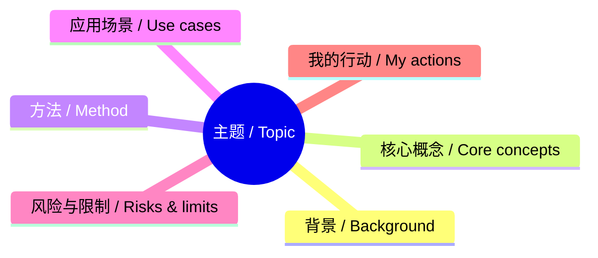

# 学习总结模板

> 适合我作为「学生 + AI 爱好者」使用：既要快速理解资讯，也要沉淀成可复习、可行动、可连接的知识。

---

## 0. 基本信息

| 项目     | 内容                                                                     |
| ------ | ---------------------------------------------------------------------- |
| 学习日期   |                                                                        |
| 来源类型   | Horizon 日报 / 网页 / 论文 / 视频 / 课程 / 项目                                    |
| 原始链接   |                                                                        |
| 所属雷达   | 技术雷达 / 工程雷达 / 现实世界雷达                                                   |
| 具体方向   | AI 应用 / 开发工具 / GitHub 趋势 / 嵌入式 / 机器人 / 硬件 / 科学研究 / 健康 / 社会发展 / 政策与公共议题 |
| 难度     | ⭐️⭐️⭐️☆☆                                                               |
| 重要性    | ⭐️⭐️⭐️⭐️☆                                                              |
| 是否值得复习 | 是 / 否                                                                  |

---

## 1. 一句话总结 / One-sentence summary

**English**:

**中文**：

---

## 2. 核心内容总结 / Core summary

### 2.1 我学到了什么？

- 
- 
- 

### 2.2 它为什么重要？

- 
- 
- 

### 2.3 它和我有什么关系？

- 对学习：
- 对 AI 使用：
- 对项目实践：
- 对长期认知：

---

## 3. 英文原文 + 中文理解

> 用于练英语：先保留英文表达，再写自己的中文理解。不要只翻译，要理解。

### Paragraph 1

**English**:

**中文理解**：

### Paragraph 2

**English**:

**中文理解**：

---

## 4. 你应该记住的 3 个知识点 / 3 things to remember

1. **English**:  
   **中文**：

2. **English**:  
   **中文**：

3. **English**:  
   **中文**：

---

## 5. 关键概念 / Key concepts

| English / 英文 | 中文 / Chinese | 我的解释 | 相关链接 |
|---|---|---|---|
|  |  |  |  |
|  |  |  |  |
|  |  |  |  |

---

## 6. 知识框架 / Knowledge framework

---

## 7. 对比图 / Comparison table

| 维度 | A | B | 我的判断 |
|---|---|---|---|
| 成本 |  |  |  |
| 效率 |  |  |  |
| 难度 |  |  |  |
| 适用场景 |  |  |  |
| 风险 |  |  |  |

---

## 8. 影响力判断 / Impact

| 维度 | 分数 1-10 | 理由 |
|---|---:|---|
| 深度 / Depth |  |  |
| 广度 / Breadth |  |  |
| 实用性 / Usefulness |  |  |
| 学习优先级 / Study priority |  |  |

---

## 9. 费曼解释 / Feynman explanation

> 假设我要讲给一个同学听，我会怎么解释？

---

## 10. 我的疑问 / Questions

- [ ] 
- [ ] 
- [ ] 

---

## 11. 下一步行动 / Next actions

- [ ] 查一个相关概念：
- [ ] 做一个小实验：
- [ ] 写一张概念卡片：
- [ ] 加入一个项目/资料库：
- [ ] 复习日期：

---

## 12. 可连接到哪些笔记？

- [[wiki 知识层/concepts 概念页]]
- [[wiki 知识层/sources 来源摘要]]
- [[wiki 知识层/comparisons 比较分析]]
- [[wiki 知识层/overview 总览综合]]

---

## 13. 最终沉淀

### 可以变成概念页的内容

- 

### 可以变成项目实践的内容

- 

### 可以加入长期追踪雷达的内容

- 
