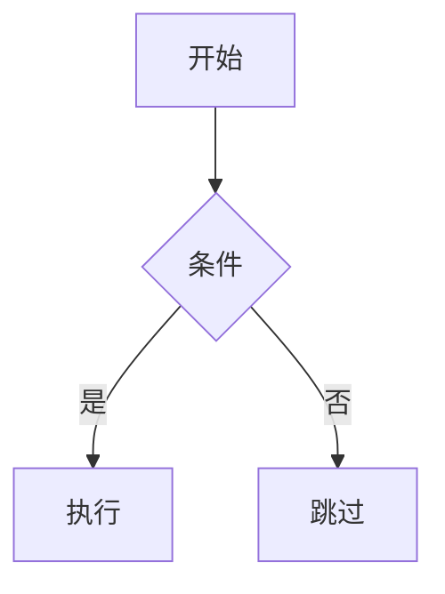

# Obsidian Markdown 格式完全指南

> 📅 收录时间: 2026-04-25
> 🔗 原文: https://medium.com/@pablo.nicolas.oshiro/obsidian-introduction-to-markdown-for-note-taking-f2cfe8cc8c79
> 🏷️ #obsidian #markdown #格式 #教程

---

## 什么是 Markdown？

Markdown 是一种轻量级的标记语言，用简单的符号来格式化文本。Obsidian 使用 Markdown 作为笔记的格式，这意味着：

- 你的笔记是纯文本文件
- 可以在任何文本编辑器中打开
- 未来不会过时
- 学习成本低，几分钟就能掌握

## 基础 Markdown 语法

### 标题

```markdown
# 一级标题（最大）
## 二级标题
### 三级标题
#### 四级标题
##### 五级标题
###### 六级标题（最小）
```

**建议**：在 Obsidian 中一般使用 H1-H4 就够了。

### 强调

```markdown
**加粗文本** — 强调重要内容
*斜体文本* — 强调语气
~~删除线~~ — 表示修改或删除
==高亮文本== — Obsidian 特有语法，标记重要内容
```

### 列表

**无序列表：**
```markdown
- 项目一
- 项目二
  - 子项目 A
  - 子项目 B
- 项目三
```

**有序列表：**
```markdown
1. 第一步
2. 第二步
3. 第三步
```

**任务列表：**
```markdown
- [ ] 未完成的任务
- [x] 已完成的任务
- [ ] 待办的事情
```

### 引用

```markdown
> 这是一条引用
> > 嵌套引用
>
> 引用的段落
```

### 代码

```markdown
`行内代码` — 用于代码片段或技术名词

```
代码块（支持语法高亮）
function hello() {
  console.log("Hello!");
}
```

```` 支持 ``` 嵌套在代码块中
```javascript
console.log("带语言标记的代码块");
```
````

### 链接与图片

```markdown
# 内部链接（Obsidian 特有）
[[笔记名称]]
[[笔记名称|别名]]

# 外部链接
[Obsidian 官网](https://obsidian.md)

# 图片


# 嵌入其他笔记
![[嵌入的笔记名称]]
```

### 分割线

```markdown
---
***
___
```

### 表格

```markdown
| 列1 | 列2 | 列3 |
|-----|-----|-----|
| 内容 | 内容 | 内容 |
```

## Obsidian 特有语法

### 双向链接
```markdown
这是关于 [[人工智能]] 的笔记，
也涉及 [[机器学习]] 和 [[深度学习]]。
```

### 笔记内嵌入
```markdown
# 嵌入其他笔记的特定部分
![[笔记名称#小节标题]]

# 嵌入笔记中的指定范围
![[笔记名称^块ID]]

# 嵌入笔记中的特定段落
![[笔记名称#特性|嵌入别名]]
```

### 标签
```markdown
#主题 #项目/进行中 #状态/已完成
```

### 数学公式
```markdown
$E = mc^2$

$$
\frac{\partial \rho}{\partial t} + \nabla \cdot (\rho \vec{v}) = 0
$$
```

### 流程图
```markdown

```

## 元数据（Frontmatter）

在笔记顶部用 YAML 定义属性：

```yaml
---
title: 笔记标题
tags: [标签1, 标签2]
created: 2026-04-25
author: 你的名字
status: 进行中
---
```

这些属性可以用于：
- Dataview 查询
- 模板变量
- 笔记分类和筛选

## Markdown 书写建议

1. **用 H1 作为标题**：每篇笔记一个 H1
2. **用 H2 分区**：把笔记分成几个逻辑区域
3. **段落间空一行**：保持可读性
4. **善用列表**：结构化信息更容易理解
5. **用链接代替目录**：用 `[[ ]]` 建立笔记间的关联
6. **保持简洁**：不要用太多格式，内容才是核心

