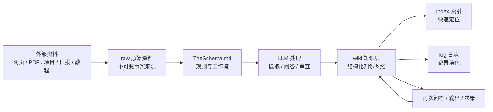
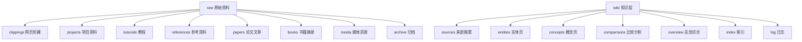
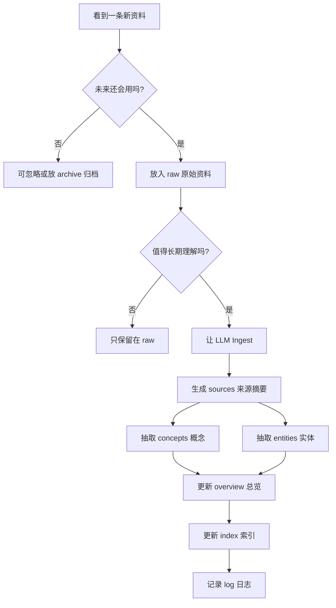
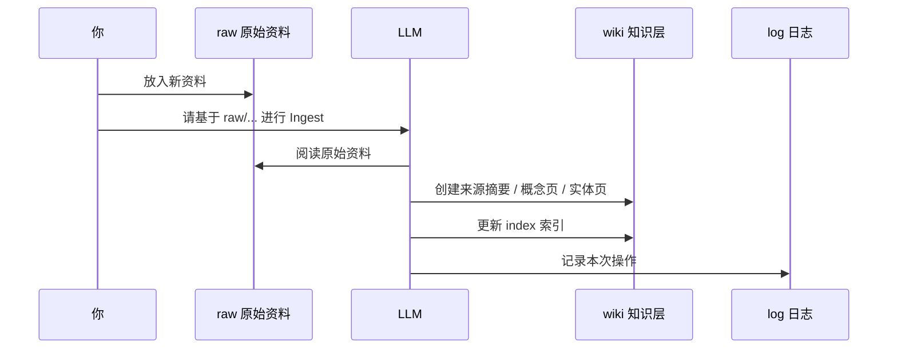
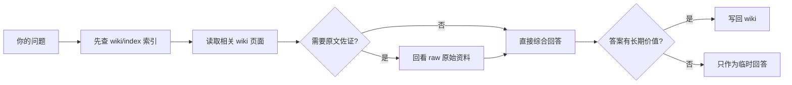
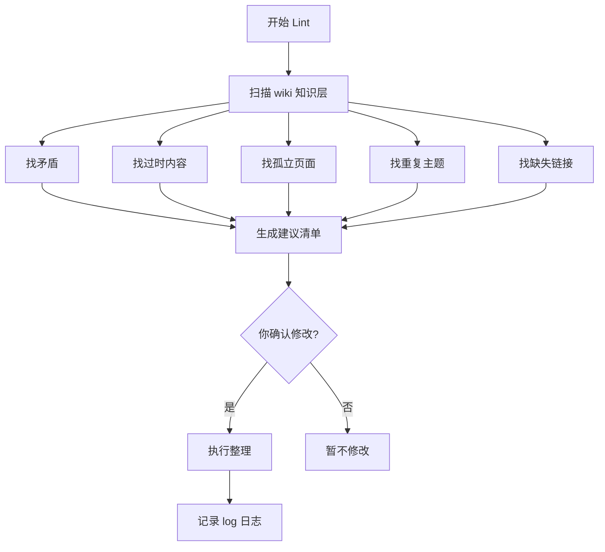

# 目录结构与工作流

> [!summary] 一句话理解
> 你的知识库现在按三层运行：`raw 原始资料/` 存事实，`wiki 知识层/` 存理解，`TheSchema.md` 定规则。

## 1. 整体结构图



## 2. 左侧目录职责



## 3. 日常工作流



## 4. 三个核心操作

### A. Ingest / 摄取



### B. Query / 问答
[[心得]]


### C. Lint / 审查



## 5. 你以后怎么发指令

### 导入资料

```text
请基于 raw 原始资料/clippings 网页剪藏/xxx.md 进行 Ingest
```

### 基于知识库问答

```text
基于 wiki 知识层，帮我回答：xxx
```

### 健康检查

```text
请对 wiki 知识层 做一次 Lint，先给建议清单，不要直接大改
```

## 6. 最简单口诀

```text
资料先进 raw
理解沉到 wiki
规则看 TheSchema
找东西看 index
改动记 log
每月做 Lint
```

## 7. 当前关键入口

- [[TheSchema]]
- [[README]]
- [[raw 原始资料/index 索引]]
- [[wiki 知识层/index 索引]]
- [[wiki 知识层/log 日志]]
- [[wiki 知识层/overview 总览综合/AI信息收集系统/00-总览]]
