# Horizon 逐段中英对照日报 - 2026-07-20

> From 33 items, 21 important content pieces were selected.
> 从 33 条内容中筛选出 21 条重要资讯。

## 使用方法 / How to read

- 先读英文，再看紧跟的中文翻译。
- 这版适合你一边学英语，一边快速理解资讯。

---

## Trade-offs / 取舍

- Speed vs. reliability / 速度 vs. 可靠性
- On-prem control vs. cloud convenience / 本地控制 vs. 云端便利
- Standardization vs. complexity / 标准化 vs. 复杂度
- Performance vs. repairability / 性能 vs. 可维修性
- Data quantity vs. interoperability / 数据数量 vs. 互操作性

## 思维导图 / Mind map

> A fast overview of the report knowledge system.
> 快速理解本期报告的知识体系。

![[wiki 知识层/overview 总览综合/AI信息收集系统/02-信号流/报告/assets/Horizon思维导图.svg]]

## 知识地图 / Knowledge map

> A larger detailed concept board for reading each node clearly.
> 更大的详细知识看板，方便看清每个节点。

![[wiki 知识层/overview 总览综合/AI信息收集系统/02-信号流/报告/assets/Horizon知识地图.svg]]

## Claude Fable Produces Counterexample to Jacobian Conjecture ⭐️ 9.0/10

Anthropic employee Levent Alpöge claimed on X that Claude Fable, an LLM, produced a concrete counterexample to the long-standing Jacobian Conjecture, which was verified in multiple ways. If confirmed, this would be a major mathematical breakthrough achieved by an AI, potentially reshaping how mathematicians approach open problems and demonstrating LLMs' capability in rigorous mathematical reasoning. The Jacobian Conjecture is notorious for many flawed proofs; the counterexample was reportedly verified by Claude Code in seven different ways. The claim has sparked both excitement and skepticism in the community.

Anthropic 员工 Levent Alpöge 在 X 上声称，LLM Claude Fable 给出了一个长期未解决的雅可比猜想的明确反例，并通过多种方式验证。 如果得到确认，这将是人工智能取得的重大数学突破，可能重塑数学家处理开放问题的方式，并展示 LLM 在严谨数学推理中的能力。 雅可比猜想因大量有缺陷的证明而臭名昭著；据称该反例通过 Claude Code 以七种不同方式验证。这一说法在社区中引发了兴奋和怀疑。

**Knowledge category / 知识分类**: AI Infrastructure / AI 基础设施

**Background**: The Jacobian Conjecture, first stated in 1884, asserts that a polynomial map with a non-zero constant Jacobian determinant has a polynomial inverse. It is a famous open problem in algebraic geometry, listed as Smale's 16th problem. A counterexample would disprove the conjecture entirely.

**背景**: 雅可比猜想最早于 1884 年提出，断言若多项式映射的雅可比行列式为非零常数，则该映射具有多项式逆。这是代数几何中著名的未解决问题，被列为 Smale 第 16 问题。一个反例将彻底推翻该猜想。

**Discussion**: Comments show mixed reactions: some are amazed by the LLM's verification ability, while others point to Wikipedia's note on many flawed proofs, suggesting caution. One user hopes LLMs can settle other conjectures like Collatz.

**社区讨论**: 评论反应不一：有人对 LLM 的验证能力感到惊讶，也有人引用维基百科关于许多有缺陷证明的说明，建议谨慎。一位用户希望 LLM 能解决其他猜想，如 Collatz 猜想。

**Tags**: `#AI`, `#mathematics`, `#LLM`, `#Jacobian Conjecture`, `#research`

---

**标签**: `#AI`, `#mathematics`, `#LLM`, `#Jacobian Conjecture`, `#research`

---

### 你应该记住的 3 个知识点 / 3 things to remember

1. Anthropic employee Levent Alpöge claimed on X that Claude Fable, an LLM, produced a concrete counterexample to the long-standing Jacobian Conjecture, which was verified in multiple ways.
   - Anthropic 员工 Levent Alpöge 在 X 上声称，LLM Claude Fable 给出了一个长期未解决的雅可比猜想的明确反例，并通过多种方式验证。
2. deployment / quality / cost
   - 部署 / 质量 / 成本
3. deployment / quality / cost
   - 部署 / 质量 / 成本

### Learning visuals / 学习图表

#### Comparison table / 对比图

| Aspect / 方面 | English / 英文 | 中文 / Chinese |
|---|---|---|
| What changed / 发生了什么 | Anthropic employee Levent Alpöge claimed on X that Claude Fable, an LLM, produced a concrete counterexample to… | Anthropic 员工 Levent Alpöge 在 X 上声称，LLM Claude Fable 给出了一个长期未解决的雅可比猜想的明确反例，并通过多种方式验证。 如果得到确认，这将是人工智能取得的重大数学突破，可… |
| Why it matters / 为什么重要 | deployment / quality / cost | 部署 / 质量 / 成本 |
| Trade-off / 取舍 | deployment / quality / cost | 部署 / 质量 / 成本 |

#### Relationship map / 关系图

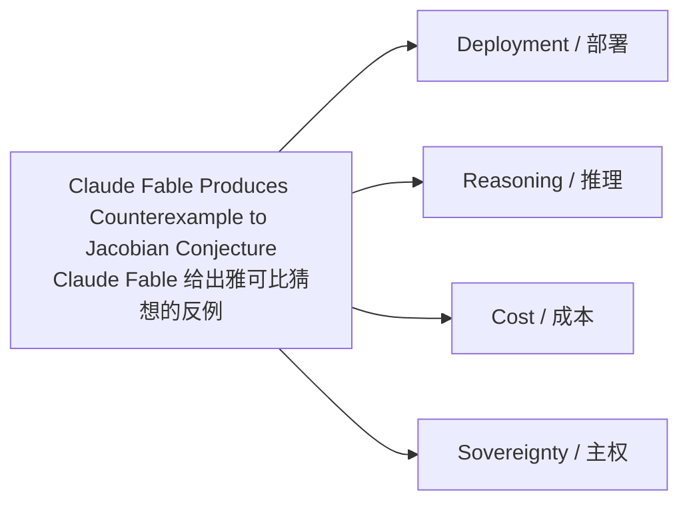
```mermaid
flowchart LR
    N1["Claude Fable Produces Counterexample to Jacobian Conjecture\nClaude Fable 给出雅可比猜想的反例"]
    N1_1["Deployment / 部署"]
    N1 --> N1_1
    N1_2["Reasoning / 推理"]
    N1 --> N1_2
    N1_3["Cost / 成本"]
    N1 --> N1_3
    N1_4["Sovereignty / 主权"]
    N1 --> N1_4
```

#### Impact chart / 影响力图

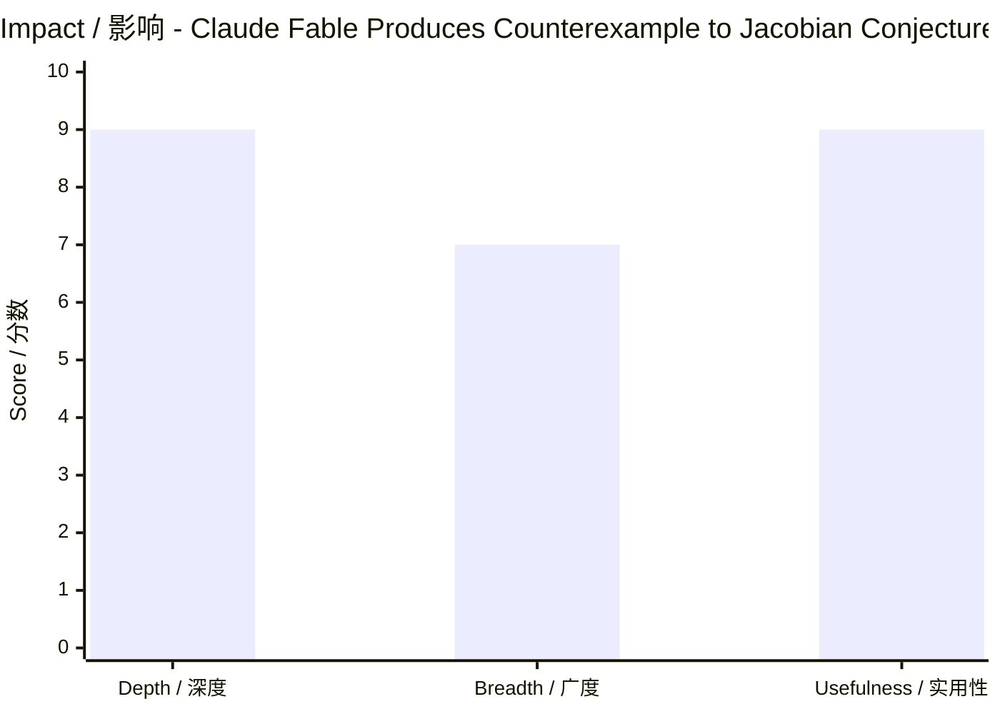
```mermaid
xychart-beta
    title "Impact / 影响 - Claude Fable Produces Counterexample to Jacobian Conjecture"
    x-axis ["Depth / 深度", "Breadth / 广度", "Usefulness / 实用性"]
    y-axis "Score / 分数" 0 --> 10
    bar [9, 7, 9]
```

#### Study priority / 学习优先级图

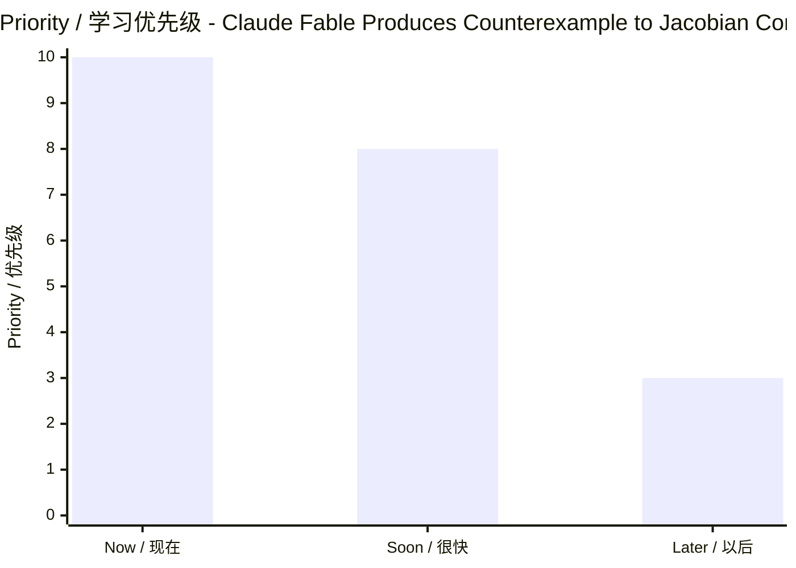
```mermaid
xychart-beta
    title "Priority / 学习优先级 - Claude Fable Produces Counterexample to Jacobian Conjecture"
    x-axis ["Now / 现在", "Soon / 很快", "Later / 以后"]
    y-axis "Priority / 优先级" 0 --> 10
    bar [10, 8, 3]
```

#### Keywords / 关键词

| English / 英文 | 中文 / Chinese |
|---|---|
| AI | AI |
| mathematics | mathematics |
| LLM | LLM |
| Jacobian Conjecture | Jacobian Conjecture |
| research | research |
| Claude | Claude |

---

## Leaked Email Reveals Altman's Open-Source Strategy ⭐️ 9.0/10

A leaked email from Sam Altman to OpenAI's board, dated October 1, 2022, and exposed in the Musk v. Altman (2026) case, reveals his proposal to release a GPT-3-level open-source model that can run on consumer hardware, aiming to discourage competitors and hinder new efforts from getting funded. This email provides rare insight into OpenAI's strategic thinking about open-source AI, revealing that the company considered releasing powerful models not purely for altruism but to preempt competition and control the market. It has significant implications for AI ethics, open-source debates, and antitrust considerations. The email specifically mentions creating a model with 'the approximate capability of GPT-3' that can run locally on consumer hardware, and proposes doing it 'before Stability or someone else does.' Altman argues this would 'discourage others from releasing similarly-powerful models' and 'make it harder for new efforts to get funded.'

一封山姆·奥特曼于 2022 年 10 月 1 日发给 OpenAI 董事会的泄露邮件（在 2026 年马斯克诉奥特曼案中曝光）显示，他提议发布一个可在消费级硬件上运行的 GPT-3 级别开源模型，旨在阻止竞争对手并阻碍新项目获得资金。 这封邮件罕见地揭示了 OpenAI 在开源 AI 方面的战略思考，表明该公司考虑发布强大模型并非纯粹出于利他主义，而是为了抢占先机并控制市场。这对 AI 伦理、开源辩论以及反垄断考量具有重大意义。 邮件特别提到要创建一个“能力接近 GPT-3”且可在消费级硬件上本地运行的模型，并提议在“Stability 或其他公司之前”发布。奥特曼认为这将“阻止其他人发布类似强大的模型”，并“使新项目更难获得资金”。

**Knowledge category / 知识分类**: AI Infrastructure / AI 基础设施

**Background**: GPT-3 is a large language model released by OpenAI in 2020, known for its ability to generate human-like text. Running such a model on consumer hardware typically requires significant optimization, as the original model is too large for most personal devices. The open-source AI movement has gained momentum with models like Meta's LLaMA and Mistral, which can be run locally. This email predates the release of many such models, showing OpenAI's early strategic considerations.

**背景**: GPT-3 是 OpenAI 于 2020 年发布的大型语言模型，以其生成类人文本的能力而闻名。在消费级硬件上运行此类模型通常需要大量优化，因为原始模型对于大多数个人设备来说太大。开源 AI 运动随着 Meta 的 LLaMA 和 Mistral 等可本地运行的模型而蓬勃发展。这封邮件早于许多此类模型的发布，显示了 OpenAI 早期的战略考量。

**Tags**: `#openai`, `#sam-altman`, `#ai-ethics`, `#open-source`, `#generative-ai`

---

**标签**: `#openai`, `#sam-altman`, `#ai-ethics`, `#open-source`, `#generative-ai`

---

### 你应该记住的 3 个知识点 / 3 things to remember

1. A leaked email from Sam Altman to OpenAI's board, dated October 1, 2022, and exposed in the Musk v.
   - 一封山姆·奥特曼于 2022 年 10 月 1 日发给 OpenAI 董事会的泄露邮件（在 2026 年马斯克诉奥特曼案中曝光）显示，他提议发布一个可在消费级硬件上运行的 GPT-3 级别开源模型，旨在阻止竞争对手并阻碍新项目获得资金。
2. deployment / quality / cost
   - 部署 / 质量 / 成本
3. deployment / quality / cost
   - 部署 / 质量 / 成本

### Learning visuals / 学习图表

#### Comparison table / 对比图

| Aspect / 方面 | English / 英文 | 中文 / Chinese |
|---|---|---|
| What changed / 发生了什么 | A leaked email from Sam Altman to OpenAI's board, dated October 1, 2022, and exposed in the Musk v. Altman (20… | 一封山姆·奥特曼于 2022 年 10 月 1 日发给 OpenAI 董事会的泄露邮件（在 2026 年马斯克诉奥特曼案中曝光）显示，他提议发布一个可在消费级硬件上运行的 GPT-3 级别开源模型，旨在阻止竞争对手并阻碍… |
| Why it matters / 为什么重要 | deployment / quality / cost | 部署 / 质量 / 成本 |
| Trade-off / 取舍 | deployment / quality / cost | 部署 / 质量 / 成本 |

#### Relationship map / 关系图

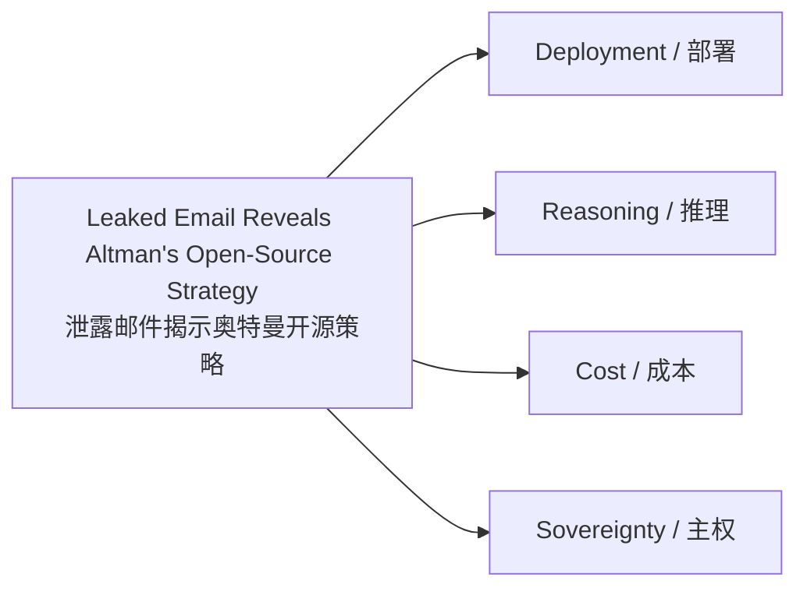
```mermaid
flowchart LR
    N2["Leaked Email Reveals Altman's Open-Source Strategy\n泄露邮件揭示奥特曼开源策略"]
    N2_1["Deployment / 部署"]
    N2 --> N2_1
    N2_2["Reasoning / 推理"]
    N2 --> N2_2
    N2_3["Cost / 成本"]
    N2 --> N2_3
    N2_4["Sovereignty / 主权"]
    N2 --> N2_4
```

#### Impact chart / 影响力图

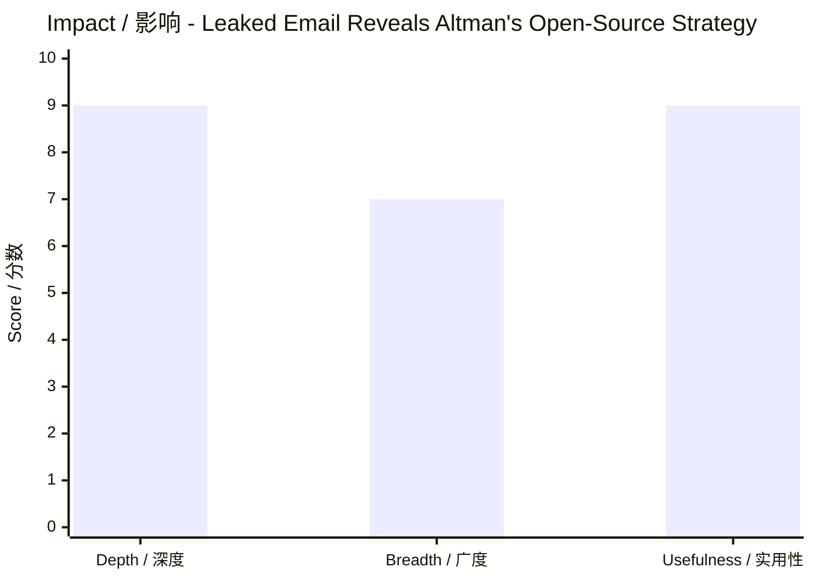
```mermaid
xychart-beta
    title "Impact / 影响 - Leaked Email Reveals Altman's Open-Source Strategy"
    x-axis ["Depth / 深度", "Breadth / 广度", "Usefulness / 实用性"]
    y-axis "Score / 分数" 0 --> 10
    bar [9, 7, 9]
```

#### Study priority / 学习优先级图

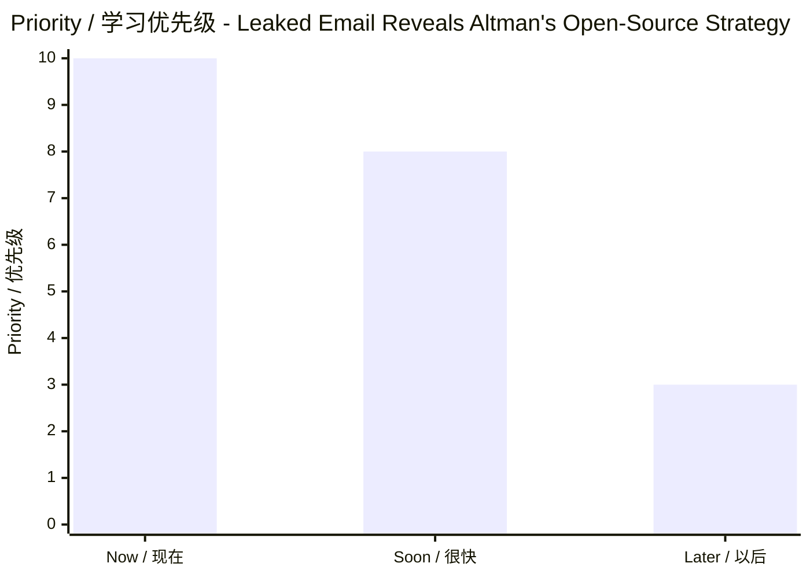
```mermaid
xychart-beta
    title "Priority / 学习优先级 - Leaked Email Reveals Altman's Open-Source Strategy"
    x-axis ["Now / 现在", "Soon / 很快", "Later / 以后"]
    y-axis "Priority / 优先级" 0 --> 10
    bar [10, 8, 3]
```

#### Keywords / 关键词

| English / 英文 | 中文 / Chinese |
|---|---|
| openai | openai |
| sam-altman | sam-altman |
| ai-ethics | ai-ethics |
| open-source | open-source |
| generative-ai | generative-ai |
| Leaked | Leaked |

---

## Bowling center owner replaces $120k system with $1,600 ESP32s ⭐️ 8.0/10

A bowling center owner built an open-source scoring system using ESP32 microcontrollers, replacing a $120,000 commercial system for about $1,600. The prototype uses ESPNow mesh networking, Redis event streaming, and a React frontend. This demonstrates how modern open hardware and software can drastically reduce costs in niche industries, challenging vendor lock-in and making retrofits accessible. It could inspire similar DIY projects in other legacy systems. The system uses ESP32 nodes with IR break-beam sensors and relays, communicating via ESPNow with an RS485 fallback. The gateway connects to a Raspberry Pi running Redis and a state machine, with a React-based UI.

一位保龄球馆老板用 ESP32 微控制器构建了开源计分系统，以约 1600 美元替代了 12 万美元的商业系统。该原型采用 ESPNow 网状网络、Redis 事件流和 React 前端。 这展示了现代开源硬件和软件如何大幅降低小众行业的成本，挑战供应商锁定，并使改造变得可行。它可能激发其他遗留系统的类似 DIY 项目。 该系统使用带有红外对射传感器和继电器的 ESP32 节点，通过 ESPNow 通信，并以 RS485 作为备用。网关连接到运行 Redis 和状态机的树莓派，UI 基于 React。

**Knowledge category / 知识分类**: Hardware & Devices / 硬件与设备

**Background**: Commercial bowling scoring systems are niche and expensive, often costing $80k-$120k for a replacement. They use camera-based pin detection and control pinsetters, but the core mechanical parts are decades old. ESP32 is a low-cost, Wi-Fi/Bluetooth-enabled microcontroller popular in IoT projects.

**背景**: 商业保龄球计分系统小众且昂贵，更换一套通常需 8 万至 12 万美元。它们使用摄像头检测球瓶并控制排瓶机，但核心机械部件已有数十年历史。ESP32 是一种低成本、支持 Wi-Fi/蓝牙的微控制器，在物联网项目中广泛使用。

**Discussion**: Commenters praised the project, sharing similar experiences retrofitting old machine tools and bowling equipment. Some expressed interest in seeing documentation or videos of the mechanical internals. Others discussed adding LED lighting and kiosk payment systems.

**社区讨论**: 评论者称赞该项目，分享了改造旧机床和保龄球设备的类似经验。有人表示希望看到文档或机械内部视频。其他人则讨论了添加 LED 照明和自助支付系统。

**Tags**: `#embedded systems`, `#ESP32`, `#retrofit`, `#cost reduction`, `#DIY`

---

**标签**: `#embedded systems`, `#ESP32`, `#retrofit`, `#cost reduction`, `#DIY`

---

### 你应该记住的 3 个知识点 / 3 things to remember

1. A bowling center owner built an open-source scoring system using ESP32 microcontrollers, replacing a $120,000 commercial system for about $1,600.
   - 一位保龄球馆老板用 ESP32 微控制器构建了开源计分系统，以约 1600 美元替代了 12 万美元的商业系统。该原型采用 ESPNow 网状网络、Redis 事件流和 React 前端。
2. performance / repairability / fit
   - 性能 / 可维修性 / 适配性
3. performance / repairability / fit
   - 性能 / 可维修性 / 适配性

### Learning visuals / 学习图表

#### Comparison table / 对比图

| Aspect / 方面 | English / 英文 | 中文 / Chinese |
|---|---|---|
| What changed / 发生了什么 | A bowling center owner built an open-source scoring system using ESP32 microcontrollers, replacing a $120,000… | 一位保龄球馆老板用 ESP32 微控制器构建了开源计分系统，以约 1600 美元替代了 12 万美元的商业系统。该原型采用 ESPNow 网状网络、Redis 事件流和 React 前端。 这展示了现代开源硬件和软件如何… |
| Why it matters / 为什么重要 | performance / repairability / fit | 性能 / 可维修性 / 适配性 |
| Trade-off / 取舍 | performance / repairability / fit | 性能 / 可维修性 / 适配性 |

#### Relationship map / 关系图

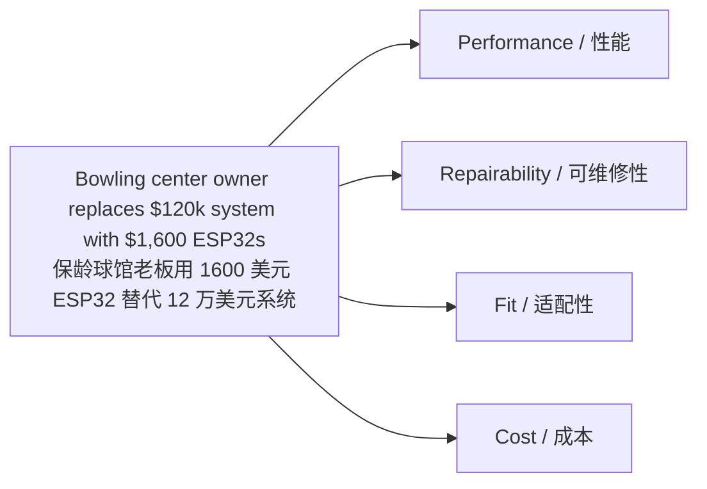
```mermaid
flowchart LR
    N3["Bowling center owner replaces $120k system with $1,600 ESP32s\n保龄球馆老板用 1600 美元 ESP32 替代 12 万美元系统"]
    N3_1["Performance / 性能"]
    N3 --> N3_1
    N3_2["Repairability / 可维修性"]
    N3 --> N3_2
    N3_3["Fit / 适配性"]
    N3 --> N3_3
    N3_4["Cost / 成本"]
    N3 --> N3_4
```

#### Impact chart / 影响力图

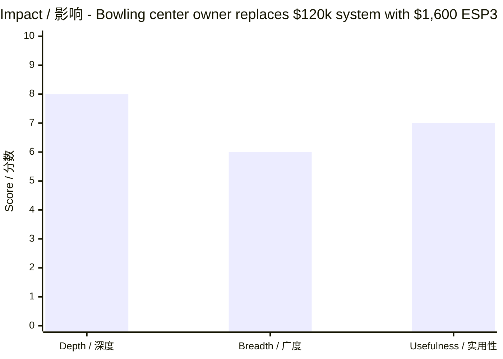
```mermaid
xychart-beta
    title "Impact / 影响 - Bowling center owner replaces $120k system with $1,600 ESP32s"
    x-axis ["Depth / 深度", "Breadth / 广度", "Usefulness / 实用性"]
    y-axis "Score / 分数" 0 --> 10
    bar [8, 6, 7]
```

#### Study priority / 学习优先级图

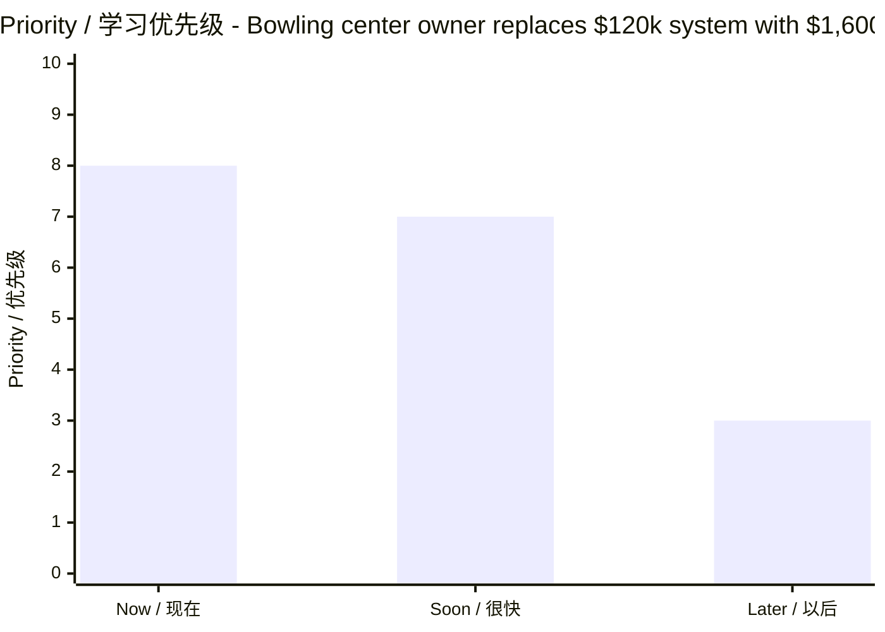
```mermaid
xychart-beta
    title "Priority / 学习优先级 - Bowling center owner replaces $120k system with $1,600 ESP32s"
    x-axis ["Now / 现在", "Soon / 很快", "Later / 以后"]
    y-axis "Priority / 优先级" 0 --> 10
    bar [8, 7, 3]
```

#### Keywords / 关键词

| English / 英文 | 中文 / Chinese |
|---|---|
| embedded systems | embedded systems |
| ESP32 | ESP32 |
| retrofit | retrofit |
| cost reduction | cost reduction |
| DIY | DIY |
| Bowling | Bowling |

---

## Bun Rewritten in Rust Using Claude Code ⭐️ 8.0/10

Bun, the JavaScript runtime originally written in Zig, has been rewritten in Rust using Anthropic's Claude Code AI tool. The massive pull request was merged in less than a month. This rewrite shifts Bun's language foundation from Zig to Rust, potentially improving memory safety and developer productivity. It also raises questions about AI-assisted development and project governance, as the rewrite was largely driven by an AI tool. The new Bun version is reported as v1.4.0, while the latest public release is v1.3.14, suggesting a preview of an unreleased version. The rewrite was completed in under a month with a 1 million+ line pull request.

最初用 Zig 编写的 JavaScript 运行时 Bun 已使用 Anthropic 的 Claude Code AI 工具用 Rust 重写。这个巨大的拉取请求在不到一个月内被合并。 这次重写将 Bun 的语言基础从 Zig 转移到 Rust，可能提高内存安全性和开发效率。它也引发了关于 AI 辅助开发和项目治理的讨论，因为重写主要由 AI 工具驱动。 新 Bun 版本报告为 v1.4.0，而最新公开版本是 v1.3.14，表明这是未发布版本的预览。重写在不到一个月内完成，拉取请求超过 100 万行。

**Knowledge category / 知识分类**: AI Infrastructure / AI 基础设施

**Background**: Bun is a fast all-in-one JavaScript runtime designed as a drop-in replacement for Node.js. It was originally written in Zig, a low-level systems programming language. Rust is another systems language known for its memory safety guarantees without a garbage collector. Claude Code is an AI coding assistant from Anthropic.

**背景**: Bun 是一个快速的全能 JavaScript 运行时，旨在作为 Node.js 的即插即用替代品。它最初用 Zig（一种底层系统编程语言）编写。Rust 是另一种以内存安全保证著称的系统语言，无需垃圾回收。Claude Code 是 Anthropic 的 AI 编码助手。

**Discussion**: Community comments are mixed: some appreciate the memory safety benefits of Rust over Zig, while others criticize the lack of communication and governance. One commenter notes the project's direction seems to have changed without proper community input.

**社区讨论**: 社区评论褒贬不一：一些人欣赏 Rust 相对于 Zig 的内存安全优势，而另一些人则批评缺乏沟通和治理。一位评论者指出，项目的方向似乎在没有适当社区意见的情况下发生了变化。

**Tags**: `#Bun`, `#Rust`, `#AI-assisted development`, `#JavaScript runtime`, `#open source`

---

**标签**: `#Bun`, `#Rust`, `#AI-assisted development`, `#JavaScript runtime`, `#open source`

---

### 你应该记住的 3 个知识点 / 3 things to remember

1. Bun, the JavaScript runtime originally written in Zig, has been rewritten in Rust using Anthropic's Claude Code AI tool.
   - 最初用 Zig 编写的 JavaScript 运行时 Bun 已使用 Anthropic 的 Claude Code AI 工具用 Rust 重写。这个巨大的拉取请求在不到一个月内被合并。
2. build speed vs. abstraction
   - 构建速度 vs. 抽象层级
3. deployment / quality / cost
   - 部署 / 质量 / 成本

### Learning visuals / 学习图表

#### Comparison table / 对比图

| Aspect / 方面 | English / 英文 | 中文 / Chinese |
|---|---|---|
| What changed / 发生了什么 | Bun, the JavaScript runtime originally written in Zig, has been rewritten in Rust using Anthropic's Claude Cod… | 最初用 Zig 编写的 JavaScript 运行时 Bun 已使用 Anthropic 的 Claude Code AI 工具用 Rust 重写。这个巨大的拉取请求在不到一个月内被合并。 这次重写将 Bun 的语言基础… |
| Why it matters / 为什么重要 | deployment / quality / cost | 部署 / 质量 / 成本 |
| Trade-off / 取舍 | build speed vs. abstraction | 构建速度 vs. 抽象层级 |

#### Relationship map / 关系图

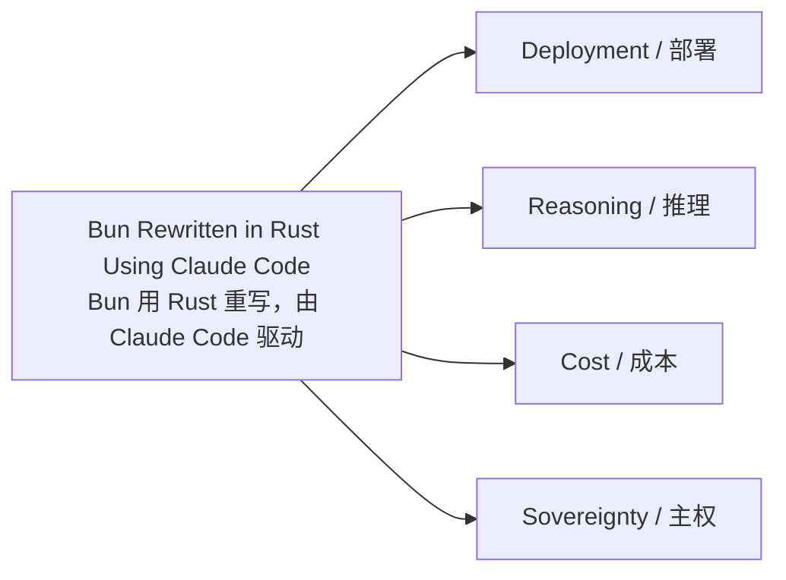
```mermaid
flowchart LR
    N4["Bun Rewritten in Rust Using Claude Code\nBun 用 Rust 重写，由 Claude Code 驱动"]
    N4_1["Deployment / 部署"]
    N4 --> N4_1
    N4_2["Reasoning / 推理"]
    N4 --> N4_2
    N4_3["Cost / 成本"]
    N4 --> N4_3
    N4_4["Sovereignty / 主权"]
    N4 --> N4_4
```

#### Impact chart / 影响力图

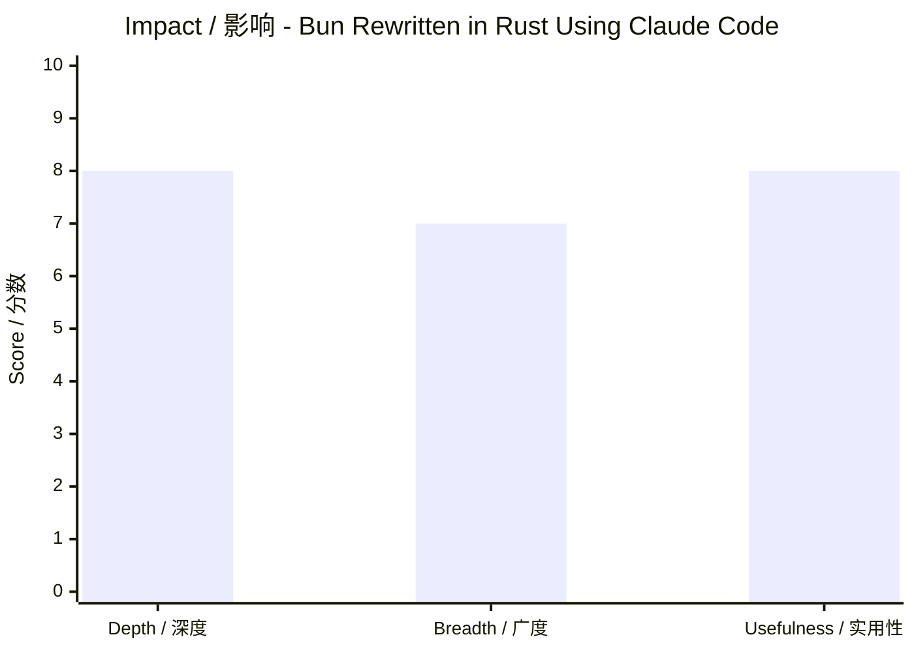
```mermaid
xychart-beta
    title "Impact / 影响 - Bun Rewritten in Rust Using Claude Code"
    x-axis ["Depth / 深度", "Breadth / 广度", "Usefulness / 实用性"]
    y-axis "Score / 分数" 0 --> 10
    bar [8, 7, 8]
```

#### Study priority / 学习优先级图

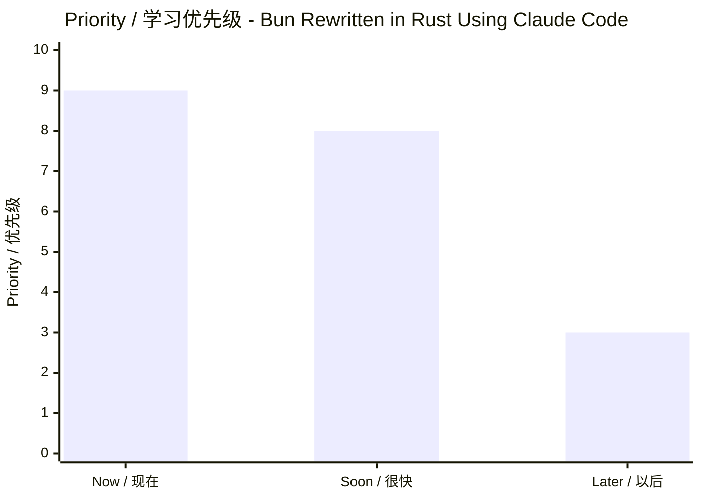
```mermaid
xychart-beta
    title "Priority / 学习优先级 - Bun Rewritten in Rust Using Claude Code"
    x-axis ["Now / 现在", "Soon / 很快", "Later / 以后"]
    y-axis "Priority / 优先级" 0 --> 10
    bar [9, 8, 3]
```

#### Keywords / 关键词

| English / 英文 | 中文 / Chinese |
|---|---|
| Bun | Bun |
| Rust | Rust |
| AI-assisted development | AI-assisted development |
| JavaScript runtime | JavaScript runtime |
| open source | 开源 |
| Rewritten | Rewritten |

---

## Alibaba Announces Qwen 3.8, a 2.4T Open-Weight LLM ⭐️ 8.0/10

Alibaba has announced Qwen 3.8, a 2.4 trillion parameter open-weights large language model (LLM), in response to Moonshot AI's Kimi K3 (2.8T parameters). The model is expected to be released on Hugging Face soon. This announcement intensifies competition in the open-source AI space, with major Chinese tech companies racing to release large open-weight models. It provides the community with more powerful, accessible alternatives to proprietary models. Qwen 3.8 has 2.4 trillion parameters, slightly smaller than Kimi K3's 2.8 trillion. Alibaba has not yet confirmed the exact release date, but the model is expected to be open-weight on Hugging Face. Previous Qwen models have received mixed feedback, with some users reporting usability issues.

阿里巴巴宣布推出 Qwen 3.8，这是一个 2.4 万亿参数的开源权重大型语言模型（LLM），以回应 Moonshot AI 的 Kimi K3（2.8 万亿参数）。该模型预计很快将在 Hugging Face 上发布。 这一公告加剧了开源 AI 领域的竞争，中国主要科技公司竞相发布大型开源权重模型。它为社区提供了更强大、更易获取的专有模型替代方案。 Qwen 3.8 拥有 2.4 万亿参数，略小于 Kimi K3 的 2.8 万亿参数。阿里巴巴尚未确认具体发布日期，但预计该模型将以开源权重形式发布在 Hugging Face 上。之前的 Qwen 模型收到了褒贬不一的反馈，一些用户报告了可用性问题。

**Knowledge category / 知识分类**: AI Infrastructure / AI 基础设施

**Background**: Open-weights LLMs are large language models whose trained parameters (weights) are publicly released, allowing developers to download, fine-tune, and deploy them freely. This contrasts with closed models like GPT-4, where only API access is provided. Alibaba's Qwen series and Moonshot AI's Kimi series are prominent Chinese open-weight LLM families.

**背景**: 开源权重 LLM 是指其训练参数（权重）公开发布的大型语言模型，允许开发者自由下载、微调和部署。这与 GPT-4 等仅提供 API 访问的封闭模型形成对比。阿里巴巴的 Qwen 系列和 Moonshot AI 的 Kimi 系列是中国著名的开源权重 LLM 家族。

**Discussion**: The community is excited about the competition, with users like adrian_b noting that it benefits everyone. Some users, like simonw, are waiting for the open weights release due to access issues. However, negative feedback on previous Qwen models, such as from user 5701652400 who found Qwen 3.7 Pro unusable, adds nuance.

**社区讨论**: 社区对这场竞争感到兴奋，用户 adrian_b 指出这对所有人都有利。一些用户（如 simonw）因访问问题正在等待开源权重发布。然而，用户 5701652400 等对之前 Qwen 模型的负面反馈（认为 Qwen 3.7 Pro 不可用）增添了复杂性。

**Tags**: `#AI`, `#LLM`, `#Open Source`, `#Alibaba`, `#Qwen`

---

**标签**: `#AI`, `#LLM`, `#Open Source`, `#Alibaba`, `#Qwen`

---

### 你应该记住的 3 个知识点 / 3 things to remember

1. Alibaba has announced Qwen 3.8, a 2.4 trillion parameter open-weights large language model (LLM), in response to Moonshot AI's Kimi K3 (2.8T parameters).
   - 阿里巴巴宣布推出 Qwen 3.8，这是一个 2.4 万亿参数的开源权重大型语言模型（LLM），以回应 Moonshot AI 的 Kimi K3（2.8 万亿参数）。该模型预计很快将在 Hugging Face 上发布。
2. deployment / quality / cost
   - 部署 / 质量 / 成本
3. deployment / quality / cost
   - 部署 / 质量 / 成本

### Learning visuals / 学习图表

#### Comparison table / 对比图

| Aspect / 方面 | English / 英文 | 中文 / Chinese |
|---|---|---|
| What changed / 发生了什么 | Alibaba has announced Qwen 3.8, a 2.4 trillion parameter open-weights large language model (LLM), in response… | 阿里巴巴宣布推出 Qwen 3.8，这是一个 2.4 万亿参数的开源权重大型语言模型（LLM），以回应 Moonshot AI 的 Kimi K3（2.8 万亿参数）。该模型预计很快将在 Hugging Face 上发布… |
| Why it matters / 为什么重要 | deployment / quality / cost | 部署 / 质量 / 成本 |
| Trade-off / 取舍 | deployment / quality / cost | 部署 / 质量 / 成本 |

#### Relationship map / 关系图

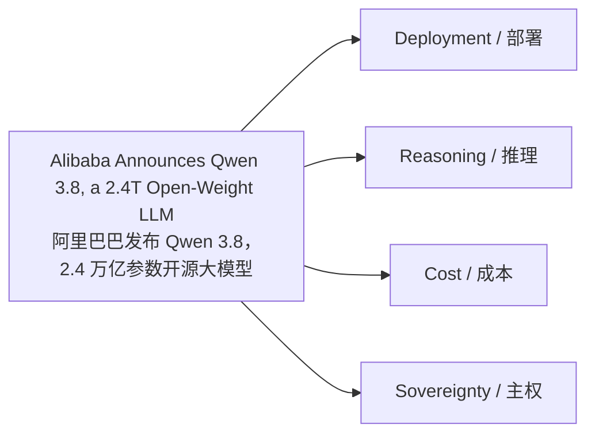
```mermaid
flowchart LR
    N5["Alibaba Announces Qwen 3.8, a 2.4T Open-Weight LLM\n阿里巴巴发布 Qwen 3.8，2.4 万亿参数开源大模型"]
    N5_1["Deployment / 部署"]
    N5 --> N5_1
    N5_2["Reasoning / 推理"]
    N5 --> N5_2
    N5_3["Cost / 成本"]
    N5 --> N5_3
    N5_4["Sovereignty / 主权"]
    N5 --> N5_4
```

#### Impact chart / 影响力图

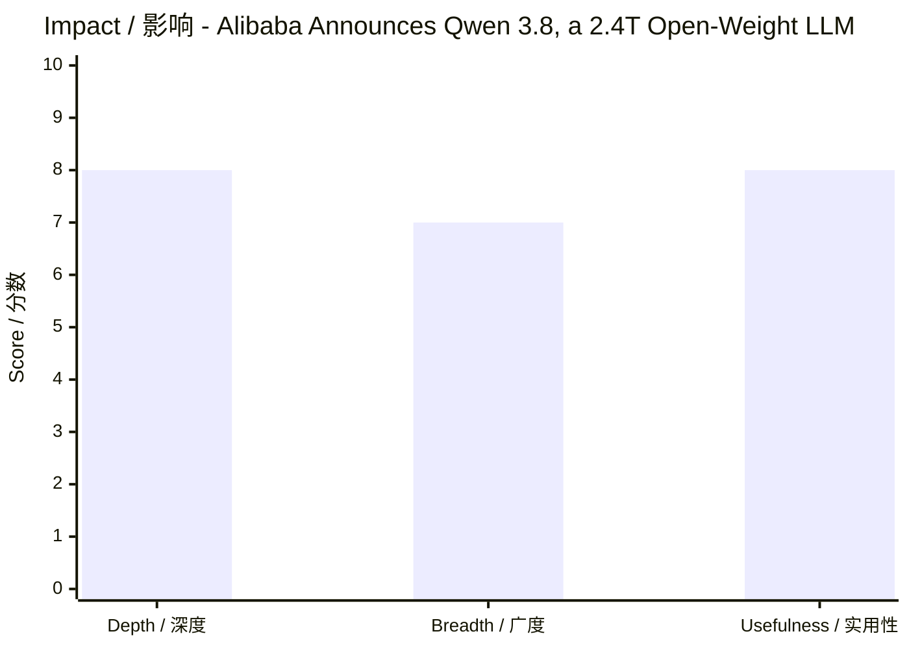
```mermaid
xychart-beta
    title "Impact / 影响 - Alibaba Announces Qwen 3.8, a 2.4T Open-Weight LLM"
    x-axis ["Depth / 深度", "Breadth / 广度", "Usefulness / 实用性"]
    y-axis "Score / 分数" 0 --> 10
    bar [8, 7, 8]
```

#### Study priority / 学习优先级图

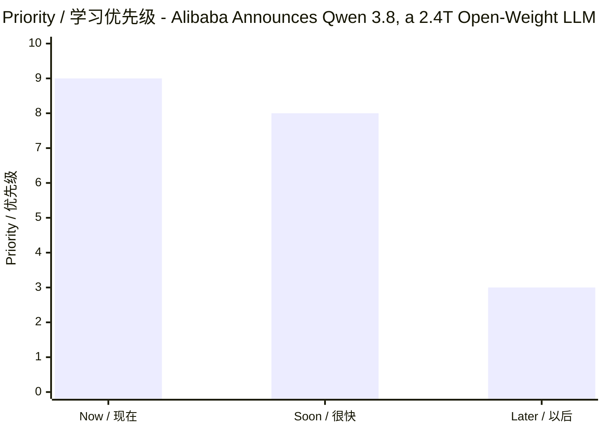
```mermaid
xychart-beta
    title "Priority / 学习优先级 - Alibaba Announces Qwen 3.8, a 2.4T Open-Weight LLM"
    x-axis ["Now / 现在", "Soon / 很快", "Later / 以后"]
    y-axis "Priority / 优先级" 0 --> 10
    bar [9, 8, 3]
```

#### Keywords / 关键词

| English / 英文 | 中文 / Chinese |
|---|---|
| AI | AI |
| LLM | LLM |
| Open Source | 开源 |
| Alibaba | Alibaba |
| Qwen | Qwen |
| Open-Weight | Open-Weight |

---

## Texas Sheriff Used ALPR to Track Woman for Abortion ⭐️ 8.0/10

EFF reported that a Texas sheriff's office searched data from over 83,000 ALPR cameras to track a woman suspected of self-managing an abortion, highlighting a new frontier of surveillance abuse. This case underscores how surveillance technologies like ALPR are being weaponized to enforce abortion bans, threatening reproductive rights and privacy for all Americans. The ALPR system used by the sheriff's office can track vehicle movements across vast areas, and the search involved data from 83,000 cameras, indicating a massive dragnet approach.

EFF 报道称，德州一警长办公室搜索了超过 83,000 个 ALPR 摄像头的数据，以追踪一名涉嫌自行管理堕胎的女性，凸显了监控滥用的新领域。 此案凸显了 ALPR 等监控技术如何被武器化以执行堕胎禁令，威胁所有美国人的生殖权利和隐私。 警长办公室使用的 ALPR 系统可以追踪大范围内的车辆移动，此次搜索涉及 83,000 个摄像头的数据，表明采用了大规模撒网式方法。

**Knowledge category / 知识分类**: Hardware & Devices / 硬件与设备

**Background**: ALPR (Automatic License Plate Recognition) is a technology that automatically reads and records license plates using cameras and optical character recognition. It is widely used by law enforcement for tasks like finding stolen cars, but its use for tracking individuals suspected of abortion raises serious privacy and civil liberties concerns. Self-managed abortion, often via medication, is legal in some states but criminalized in others, leading to a patchwork of laws.

**背景**: ALPR（自动车牌识别）是一种利用摄像头和光学字符识别自动读取和记录车牌的技术。执法部门广泛用于寻找被盗车辆等任务，但用于追踪涉嫌堕胎的个人则引发了严重的隐私和公民自由担忧。自行管理堕胎（通常通过药物）在某些州合法，但在其他州被定为犯罪，导致法律碎片化。

**Discussion**: Commenters expressed outrage and concern, with one noting that period tracking apps are now unsafe in many states. Another highlighted a case in Estonia where a police officer was fired for database misuse, contrasting with the US lack of accountability. Some pointed to a growing movement to criminally hold women liable for abortion.

**社区讨论**: 评论者表达了愤怒和担忧，有人指出经期追踪应用在许多州已不再安全。另有人提到爱沙尼亚一名警察因滥用数据库被解雇的案例，与美国缺乏问责形成对比。还有人指出，将女性对堕胎负有刑事责任的运动正在增长。

**Tags**: `#surveillance`, `#privacy`, `#reproductive rights`, `#civil liberties`, `#ALPR`

---

**标签**: `#surveillance`, `#privacy`, `#reproductive rights`, `#civil liberties`, `#ALPR`

---

### 你应该记住的 3 个知识点 / 3 things to remember

1. EFF reported that a Texas sheriff's office searched data from over 83,000 ALPR cameras to track a woman suspected of self-managing an abortion, highlighting a new frontier of surveillance abuse.
   - EFF 报道称，德州一警长办公室搜索了超过 83,000 个 ALPR 摄像头的数据，以追踪一名涉嫌自行管理堕胎的女性，凸显了监控滥用的新领域。
2. performance / repairability / fit
   - 性能 / 可维修性 / 适配性
3. performance / repairability / fit
   - 性能 / 可维修性 / 适配性

### Learning visuals / 学习图表

#### Comparison table / 对比图

| Aspect / 方面 | English / 英文 | 中文 / Chinese |
|---|---|---|
| What changed / 发生了什么 | EFF reported that a Texas sheriff's office searched data from over 83,000 ALPR cameras to track a woman suspec… | EFF 报道称，德州一警长办公室搜索了超过 83,000 个 ALPR 摄像头的数据，以追踪一名涉嫌自行管理堕胎的女性，凸显了监控滥用的新领域。 此案凸显了 ALPR 等监控技术如何被武器化以执行堕胎禁令，威胁所有美国人… |
| Why it matters / 为什么重要 | performance / repairability / fit | 性能 / 可维修性 / 适配性 |
| Trade-off / 取舍 | performance / repairability / fit | 性能 / 可维修性 / 适配性 |

#### Relationship map / 关系图

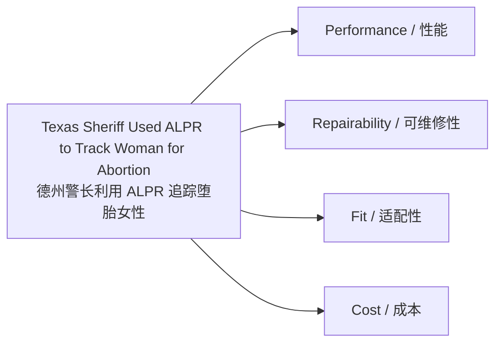
```mermaid
flowchart LR
    N6["Texas Sheriff Used ALPR to Track Woman for Abortion\n德州警长利用 ALPR 追踪堕胎女性"]
    N6_1["Performance / 性能"]
    N6 --> N6_1
    N6_2["Repairability / 可维修性"]
    N6 --> N6_2
    N6_3["Fit / 适配性"]
    N6 --> N6_3
    N6_4["Cost / 成本"]
    N6 --> N6_4
```

#### Impact chart / 影响力图

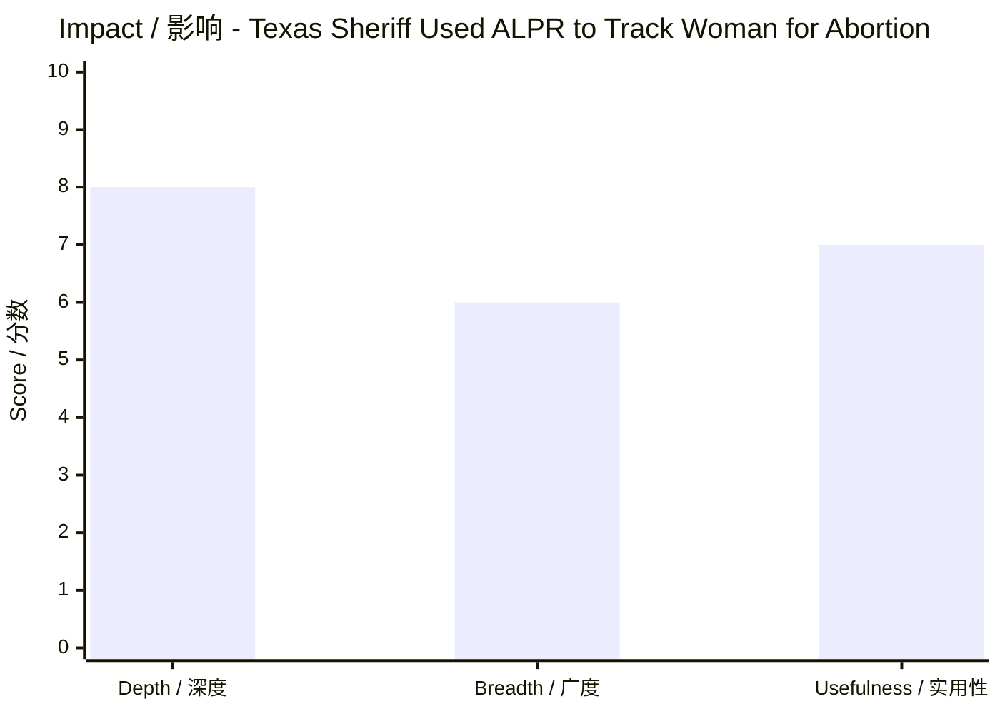
```mermaid
xychart-beta
    title "Impact / 影响 - Texas Sheriff Used ALPR to Track Woman for Abortion"
    x-axis ["Depth / 深度", "Breadth / 广度", "Usefulness / 实用性"]
    y-axis "Score / 分数" 0 --> 10
    bar [8, 6, 7]
```

#### Study priority / 学习优先级图

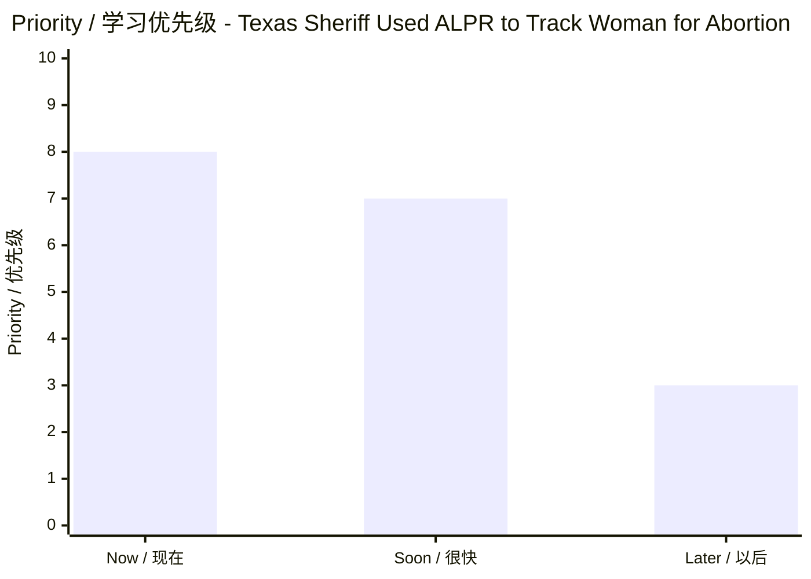
```mermaid
xychart-beta
    title "Priority / 学习优先级 - Texas Sheriff Used ALPR to Track Woman for Abortion"
    x-axis ["Now / 现在", "Soon / 很快", "Later / 以后"]
    y-axis "Priority / 优先级" 0 --> 10
    bar [8, 7, 3]
```

#### Keywords / 关键词

| English / 英文 | 中文 / Chinese |
|---|---|
| surveillance | surveillance |
| privacy | 隐私 |
| reproductive rights | reproductive rights |
| civil liberties | civil liberties |
| ALPR | ALPR |
| Texas | Texas |

---

## Moonshine: Headless Game Streaming via Moonlight ⭐️ 7.0/10

Moonshine is an open-source tool that extends the Sunshine/Moonlight ecosystem to allow game streaming from a PC to any device without requiring a physical display on the host. It enables headless streaming, meaning the host PC can stream games without occupying its own screen. This solves a key limitation of Sunshine/Moonlight, where the host display had to be active and showing the game, making the host unusable for other tasks. Moonshine enables multi-seat setups and dedicated game streaming servers, improving flexibility for enthusiasts and home lab users. Moonshine works by creating a virtual display on the host, allowing Sunshine to stream without a physical monitor. It is compatible with any Moonlight client and supports hardware encoding via AMD, Intel, and NVIDIA GPUs.

Moonshine 是一个开源工具，它扩展了 Sunshine/Moonlight 生态系统，允许从 PC 向任何设备串流游戏，而无需主机连接物理显示器。它实现了无头串流，即主机 PC 可以在不占用自身屏幕的情况下串流游戏。 这解决了 Sunshine/Moonlight 的一个关键限制——主机显示器必须开启并显示游戏画面，导致主机无法用于其他任务。Moonshine 支持多席位设置和专用游戏串流服务器，提高了爱好者和家庭实验室用户的灵活性。 Moonshine 通过在主机上创建虚拟显示器来工作，使 Sunshine 无需物理显示器即可串流。它与任何 Moonlight 客户端兼容，并支持通过 AMD、Intel 和 NVIDIA GPU 进行硬件编码。

**Knowledge category / 知识分类**: Hardware & Devices / 硬件与设备

**Background**: Sunshine is an open-source self-hosted game stream host that implements NVIDIA's GameStream protocol, and Moonlight is the corresponding client that runs on various devices. Together they enable low-latency game streaming from a PC to phones, tablets, laptops, and TVs. However, standard Sunshine requires a physical display to be connected and active, which limits its use in headless or multi-seat scenarios.

**背景**: Sunshine 是一个开源自托管游戏串流主机，实现了 NVIDIA 的 GameStream 协议，而 Moonlight 是运行在各种设备上的对应客户端。两者结合可实现从 PC 到手机、平板、笔记本电脑和电视的低延迟游戏串流。然而，标准 Sunshine 需要连接并激活物理显示器，这限制了其在无头或多席位场景中的使用。

**Discussion**: Community comments highlight that Moonshine addresses a real pain point: users previously had to keep the host display active, making the host unusable for other work. One user shared that with Apollo (a similar tool) they achieve near-zero lag over Wi-Fi 7, while another noted that headless streaming is also used for emulated console games on older systems.

**社区讨论**: 社区评论强调 Moonshine 解决了一个实际痛点：用户之前必须保持主机显示器开启，导致主机无法用于其他工作。一位用户分享说，使用 Apollo（类似工具）在 Wi-Fi 7 上实现了几乎零延迟，另一位用户指出无头串流也用于在旧系统上模拟主机游戏。

**Tags**: `#game streaming`, `#open source`, `#Moonlight`, `#Sunshine`, `#headless`

---

**标签**: `#game streaming`, `#open source`, `#Moonlight`, `#Sunshine`, `#headless`

---

### 你应该记住的 3 个知识点 / 3 things to remember

1. Moonshine is an open-source tool that extends the Sunshine/Moonlight ecosystem to allow game streaming from a PC to any device without requiring a physical display on the host.
   - Moonshine 是一个开源工具，它扩展了 Sunshine/Moonlight 生态系统，允许从 PC 向任何设备串流游戏，而无需主机连接物理显示器。它实现了无头串流，即主机 PC 可以在不占用自身屏幕的情况下串流游戏。
2. performance / repairability / fit
   - 性能 / 可维修性 / 适配性
3. performance / repairability / fit
   - 性能 / 可维修性 / 适配性

### Learning visuals / 学习图表

#### Comparison table / 对比图

| Aspect / 方面 | English / 英文 | 中文 / Chinese |
|---|---|---|
| What changed / 发生了什么 | Moonshine is an open-source tool that extends the Sunshine/Moonlight ecosystem to allow game streaming from a… | Moonshine 是一个开源工具，它扩展了 Sunshine/Moonlight 生态系统，允许从 PC 向任何设备串流游戏，而无需主机连接物理显示器。它实现了无头串流，即主机 PC 可以在不占用自身屏幕的情况下串流游… |
| Why it matters / 为什么重要 | performance / repairability / fit | 性能 / 可维修性 / 适配性 |
| Trade-off / 取舍 | performance / repairability / fit | 性能 / 可维修性 / 适配性 |

#### Relationship map / 关系图

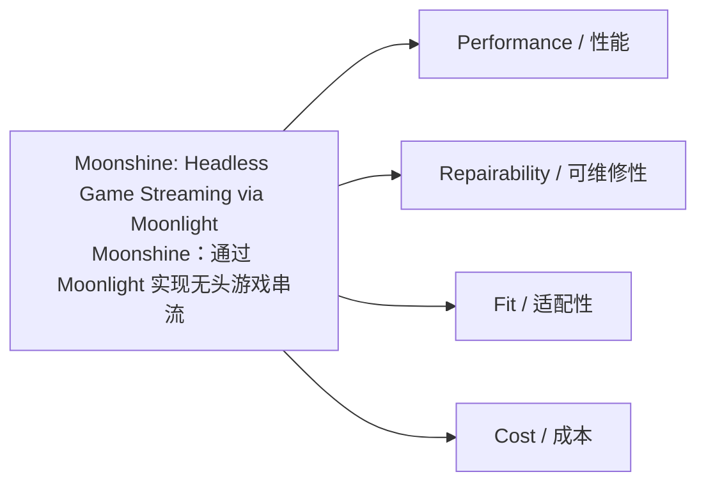
```mermaid
flowchart LR
    N7["Moonshine: Headless Game Streaming via Moonlight\nMoonshine：通过 Moonlight 实现无头游戏串流"]
    N7_1["Performance / 性能"]
    N7 --> N7_1
    N7_2["Repairability / 可维修性"]
    N7 --> N7_2
    N7_3["Fit / 适配性"]
    N7 --> N7_3
    N7_4["Cost / 成本"]
    N7 --> N7_4
```

#### Impact chart / 影响力图

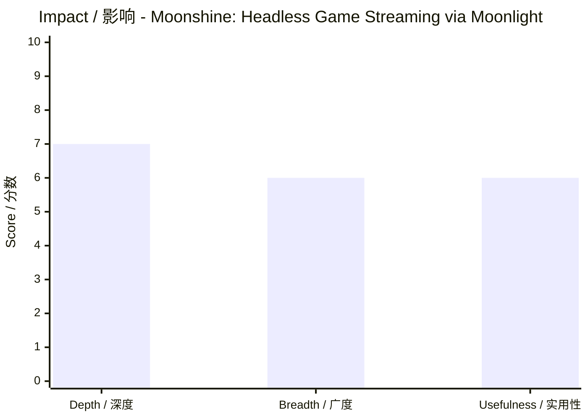
```mermaid
xychart-beta
    title "Impact / 影响 - Moonshine: Headless Game Streaming via Moonlight"
    x-axis ["Depth / 深度", "Breadth / 广度", "Usefulness / 实用性"]
    y-axis "Score / 分数" 0 --> 10
    bar [7, 6, 6]
```

#### Study priority / 学习优先级图

```mermaid
xychart-beta
    title "Priority / 学习优先级 - Moonshine: Headless Game Streaming via Moonlight"
    x-axis ["Now / 现在", "Soon / 很快", "Later / 以后"]
    y-axis "Priority / 优先级" 0 --> 10
    bar [7, 6, 4]
```

#### Keywords / 关键词

| English / 英文 | 中文 / Chinese |
|---|---|
| game streaming | game streaming |
| open source | 开源 |
| Moonlight | Moonlight |
| Sunshine | Sunshine |
| headless | headless |
| Moonshine | Moonshine |

---

## Hardware is not so hard: Lessons from 2,500 MIDI recorders ⭐️ 7.0/10

A developer published a detailed retrospective on selling 2,500 JamCorder MIDI recorders, arguing that hardware development can be simpler than expected by making careful design choices. This provides practical, real-world insights for indie developers and entrepreneurs considering hardware products, challenging the common belief that hardware is inherently difficult. The JamCorder is a simple device with only 25 components on its PCB and a two-part injection-molded clamshell case, which kept manufacturing costs low and assembly straightforward.

一位开发者发布了销售 2500 台 JamCorder MIDI 录音机的详细回顾，认为通过精心设计，硬件开发可以比预期更简单。 这为考虑硬件产品的独立开发者和创业者提供了实用的现实见解，挑战了硬件天生困难的普遍观念。 JamCorder 是一款简单的设备，其 PCB 上只有 25 个元件，外壳是两件式注塑成型翻盖壳，从而保持了低制造成本和简单的组装流程。

**Knowledge category / 知识分类**: Hardware & Devices / 硬件与设备

**Background**: MIDI (Musical Instrument Digital Interface) is a technical standard for connecting electronic musical instruments and computers. A MIDI recorder captures performance data (e.g., note on/off, velocity) rather than audio, allowing playback on any MIDI-compatible device.

**背景**: MIDI（乐器数字接口）是连接电子乐器和计算机的技术标准。MIDI 录音机捕获的是演奏数据（如音符开/关、力度）而非音频，从而可以在任何兼容 MIDI 的设备上回放。

**Discussion**: Commenters generally praised the product and insights, though some noted that hardware difficulty scales with product complexity and that the JamCorder's simplicity is not representative of most hardware projects.

**社区讨论**: 评论者普遍称赞该产品和见解，但有人指出硬件难度随产品复杂度而增加，JamCorder 的简单性并不代表大多数硬件项目。

**Tags**: `#hardware`, `#product development`, `#entrepreneurship`, `#MIDI`, `#engineering`

---

**标签**: `#hardware`, `#product development`, `#entrepreneurship`, `#MIDI`, `#engineering`

---

### 你应该记住的 3 个知识点 / 3 things to remember

1. A developer published a detailed retrospective on selling 2,500 JamCorder MIDI recorders, arguing that hardware development can be simpler than expected by making careful design choices.
   - 一位开发者发布了销售 2500 台 JamCorder MIDI 录音机的详细回顾，认为通过精心设计，硬件开发可以比预期更简单。
2. performance / repairability / fit
   - 性能 / 可维修性 / 适配性
3. performance / repairability / fit
   - 性能 / 可维修性 / 适配性

### Learning visuals / 学习图表

#### Comparison table / 对比图

| Aspect / 方面 | English / 英文 | 中文 / Chinese |
|---|---|---|
| What changed / 发生了什么 | A developer published a detailed retrospective on selling 2,500 JamCorder MIDI recorders, arguing that hardwar… | 一位开发者发布了销售 2500 台 JamCorder MIDI 录音机的详细回顾，认为通过精心设计，硬件开发可以比预期更简单。 这为考虑硬件产品的独立开发者和创业者提供了实用的现实见解，挑战了硬件天生困难的普遍观念… |
| Why it matters / 为什么重要 | performance / repairability / fit | 性能 / 可维修性 / 适配性 |
| Trade-off / 取舍 | performance / repairability / fit | 性能 / 可维修性 / 适配性 |

#### Relationship map / 关系图

```mermaid
flowchart LR
    N8["Hardware is not so hard: Lessons from 2,500 MIDI recorders\n硬件没那么难：2500 台 MIDI 录音机的经验"]
    N8_1["Performance / 性能"]
    N8 --> N8_1
    N8_2["Repairability / 可维修性"]
    N8 --> N8_2
    N8_3["Fit / 适配性"]
    N8 --> N8_3
    N8_4["Cost / 成本"]
    N8 --> N8_4
```

#### Impact chart / 影响力图

```mermaid
xychart-beta
    title "Impact / 影响 - Hardware is not so hard: Lessons from 2,500 MIDI recorders"
    x-axis ["Depth / 深度", "Breadth / 广度", "Usefulness / 实用性"]
    y-axis "Score / 分数" 0 --> 10
    bar [7, 6, 6]
```

#### Study priority / 学习优先级图

```mermaid
xychart-beta
    title "Priority / 学习优先级 - Hardware is not so hard: Lessons from 2,500 MIDI recorders"
    x-axis ["Now / 现在", "Soon / 很快", "Later / 以后"]
    y-axis "Priority / 优先级" 0 --> 10
    bar [7, 6, 4]
```

#### Keywords / 关键词

| English / 英文 | 中文 / Chinese |
|---|---|
| hardware | hardware |
| product development | product development |
| entrepreneurship | entrepreneurship |
| MIDI | MIDI |
| engineering | engineering |
| hard | hard |

---

## Minecraft Java Edition Switches to SDL3 ⭐️ 7.0/10

Minecraft: Java Edition has updated its underlying input and windowing library from SDL2 to SDL3 in snapshot 26w04a, marking a major dependency upgrade for the game. This upgrade improves cross-platform performance and future-proofs Minecraft against modern display and input APIs, benefiting millions of players and mod developers. Known issues include crashes on Windows when using exclusive fullscreen with multiple monitors, and crashes on Wayland when entering exclusive fullscreen mode.

Minecraft: Java Edition 在快照 26w04a 中将其底层输入和窗口库从 SDL2 升级为 SDL3，标志着游戏依赖项的重大更新。 此次升级提升了跨平台性能，并使 Minecraft 能够适应现代显示和输入 API，惠及数百万玩家和模组开发者。 已知问题包括在 Windows 上使用多显示器独占全屏时崩溃，以及在 Wayland 上进入独占全屏模式时崩溃。

**Knowledge category / 知识分类**: Hardware & Devices / 硬件与设备

**Background**: SDL (Simple DirectMedia Layer) is a cross-platform library that provides low-level access to audio, keyboard, mouse, and graphics hardware. SDL3, released in January 2025, is a major version with API changes and improved support for modern systems. Minecraft uses LWJGL (Lightweight Java Game Library) to bind native libraries like SDL for Java.

**背景**: SDL（Simple DirectMedia Layer）是一个跨平台库，提供对音频、键盘、鼠标和图形硬件的底层访问。SDL3 于 2025 年 1 月发布，是一个主要版本，包含 API 变更和对现代系统的更好支持。Minecraft 使用 LWJGL（Lightweight Java Game Library）来绑定 SDL 等原生库到 Java。

**Discussion**: Community members shared positive porting experiences, with one developer noting a mostly painless refactor from GLFW to SDL3. However, concerns were raised about the blocking nature of the known fullscreen crashes, with hopes they are fixed before the stable release.

**社区讨论**: 社区成员分享了积极的移植经验，一位开发者指出从 GLFW 迁移到 SDL3 的改造基本顺利。但也有人对已知的全屏崩溃问题表示担忧，希望能在稳定版发布前修复。

**Tags**: `#Minecraft`, `#SDL3`, `#game development`, `#LWJGL`, `#open source`

---

**标签**: `#Minecraft`, `#SDL3`, `#game development`, `#LWJGL`, `#open source`

---

### 你应该记住的 3 个知识点 / 3 things to remember

1. Minecraft: Java Edition has updated its underlying input and windowing library from SDL2 to SDL3 in snapshot 26w04a, marking a major dependency upgrade for the game.
   - Minecraft: Java Edition 在快照 26w04a 中将其底层输入和窗口库从 SDL2 升级为 SDL3，标志着游戏依赖项的重大更新。
2. performance / repairability / fit
   - 性能 / 可维修性 / 适配性
3. performance / repairability / fit
   - 性能 / 可维修性 / 适配性

### Learning visuals / 学习图表

#### Comparison table / 对比图

| Aspect / 方面 | English / 英文 | 中文 / Chinese |
|---|---|---|
| What changed / 发生了什么 | Minecraft: Java Edition has updated its underlying input and windowing library from SDL2 to SDL3 in snapshot 2… | Minecraft: Java Edition 在快照 26w04a 中将其底层输入和窗口库从 SDL2 升级为 SDL3，标志着游戏依赖项的重大更新。 此次升级提升了跨平台性能，并使 Minecraft 能够适应现代显… |
| Why it matters / 为什么重要 | performance / repairability / fit | 性能 / 可维修性 / 适配性 |
| Trade-off / 取舍 | performance / repairability / fit | 性能 / 可维修性 / 适配性 |

#### Relationship map / 关系图

```mermaid
flowchart LR
    N9["Minecraft Java Edition Switches to SDL3\nMinecraft Java 版改用 SDL3"]
    N9_1["Performance / 性能"]
    N9 --> N9_1
    N9_2["Repairability / 可维修性"]
    N9 --> N9_2
    N9_3["Fit / 适配性"]
    N9 --> N9_3
    N9_4["Cost / 成本"]
    N9 --> N9_4
```

#### Impact chart / 影响力图

```mermaid
xychart-beta
    title "Impact / 影响 - Minecraft Java Edition Switches to SDL3"
    x-axis ["Depth / 深度", "Breadth / 广度", "Usefulness / 实用性"]
    y-axis "Score / 分数" 0 --> 10
    bar [7, 6, 6]
```

#### Study priority / 学习优先级图

```mermaid
xychart-beta
    title "Priority / 学习优先级 - Minecraft Java Edition Switches to SDL3"
    x-axis ["Now / 现在", "Soon / 很快", "Later / 以后"]
    y-axis "Priority / 优先级" 0 --> 10
    bar [7, 6, 4]
```

#### Keywords / 关键词

| English / 英文 | 中文 / Chinese |
|---|---|
| Minecraft | Minecraft |
| SDL3 | SDL3 |
| game development | game development |
| LWJGL | LWJGL |
| open source | 开源 |
| Java | Java |

---

## New IA-64 Emulator Boots Windows ⭐️ 7.0/10

Yufeng Gao, with help from gdwnldsKSC, released version 0.1 of an Intel Itanium (IA-64) emulator that can boot Windows Server 2003 and Windows XP 64-bit for IA-64. This is the first publicly available IA-64 emulator capable of booting Windows, reviving a niche but historically significant architecture for retrocomputing and software preservation. The emulator currently only boots Windows; OpenVMS, HP-UX, Linux, and BSD do not boot yet. Performance is described as 486-level on a Ryzen 5000 series host.

Yufeng Gao 在 gdwnldsKSC 的帮助下发布了 Intel Itanium (IA-64)模拟器 0.1 版，该模拟器能够启动面向 IA-64 的 Windows Server 2003 和 Windows XP 64 位系统。 这是首个能够启动 Windows 的公开 IA-64 模拟器，为复古计算和软件保护复兴了这一小众但具有历史意义的架构。 该模拟器目前仅能启动 Windows；OpenVMS、HP-UX、Linux 和 BSD 尚无法启动。性能方面，在 Ryzen 5000 系列主机上仅相当于 486 级别。

**Knowledge category / 知识分类**: Hardware & Devices / 硬件与设备

**Background**: IA-64 (Itanium) is a 64-bit architecture developed by Intel and HP, intended for high-end servers but ultimately failed in the market due to poor x86 compatibility and competition from x86-64. Emulating it has been challenging due to its complex VLIW instruction set and lack of documentation.

**背景**: IA-64（安腾）是 Intel 和 HP 开发的 64 位架构，面向高端服务器，但因 x86 兼容性差和 x86-64 的竞争而最终在市场上失败。由于其复杂的 VLIW 指令集和缺乏文档，模拟 IA-64 一直颇具挑战。

**Discussion**: Community comments include historical anecdotes about IA-64 Windows usage in banking, jokes about the emulator's slow performance, and suggestions to integrate the work into QEMU. There is also mention of a separate 'vibe-coded' IA-64 emulation for QEMU on GitHub.

**社区讨论**: 社区评论包括关于 IA-64 Windows 在银行业使用的历史轶事、对模拟器性能缓慢的调侃，以及建议将该工作整合到 QEMU 中。还提到 GitHub 上有一个独立的“vibe-coded” IA-64 QEMU 模拟实现。

**Tags**: `#emulation`, `#IA-64`, `#Windows`, `#retrocomputing`, `#QEMU`

---

**标签**: `#emulation`, `#IA-64`, `#Windows`, `#retrocomputing`, `#QEMU`

---

### 你应该记住的 3 个知识点 / 3 things to remember

1. Yufeng Gao, with help from gdwnldsKSC, released version 0.1 of an Intel Itanium (IA-64) emulator that can boot Windows Server 2003 and Windows XP 64-bit for IA-64.
   - Yufeng Gao 在 gdwnldsKSC 的帮助下发布了 Intel Itanium (IA-64)模拟器 0.1 版，该模拟器能够启动面向 IA-64 的 Windows Server 2003 和 Windows XP 64 位系统。
2. performance / repairability / fit
   - 性能 / 可维修性 / 适配性
3. performance / repairability / fit
   - 性能 / 可维修性 / 适配性

### Learning visuals / 学习图表

#### Comparison table / 对比图

| Aspect / 方面 | English / 英文 | 中文 / Chinese |
|---|---|---|
| What changed / 发生了什么 | Yufeng Gao, with help from gdwnldsKSC, released version 0.1 of an Intel Itanium (IA-64) emulator that can boot… | Yufeng Gao 在 gdwnldsKSC 的帮助下发布了 Intel Itanium (IA-64)模拟器 0.1 版，该模拟器能够启动面向 IA-64 的 Windows Server 2003 和 Window… |
| Why it matters / 为什么重要 | performance / repairability / fit | 性能 / 可维修性 / 适配性 |
| Trade-off / 取舍 | performance / repairability / fit | 性能 / 可维修性 / 适配性 |

#### Relationship map / 关系图

```mermaid
flowchart LR
    N10["New IA-64 Emulator Boots Windows\n新 IA-64 模拟器成功启动 Windows"]
    N10_1["Performance / 性能"]
    N10 --> N10_1
    N10_2["Repairability / 可维修性"]
    N10 --> N10_2
    N10_3["Fit / 适配性"]
    N10 --> N10_3
    N10_4["Cost / 成本"]
    N10 --> N10_4
```

#### Impact chart / 影响力图

```mermaid
xychart-beta
    title "Impact / 影响 - New IA-64 Emulator Boots Windows"
    x-axis ["Depth / 深度", "Breadth / 广度", "Usefulness / 实用性"]
    y-axis "Score / 分数" 0 --> 10
    bar [7, 6, 6]
```

#### Study priority / 学习优先级图

```mermaid
xychart-beta
    title "Priority / 学习优先级 - New IA-64 Emulator Boots Windows"
    x-axis ["Now / 现在", "Soon / 很快", "Later / 以后"]
    y-axis "Priority / 优先级" 0 --> 10
    bar [7, 6, 4]
```

#### Keywords / 关键词

| English / 英文 | 中文 / Chinese |
|---|---|
| emulation | emulation |
| IA-64 | IA-64 |
| Windows | Windows |
| retrocomputing | retrocomputing |
| QEMU | QEMU |
| Emulator | Emulator |

---

## Meta-Analysis: Developer Builds Pipeline to Debug Token Costs ⭐️ 7.0/10

A developer humorously built a deep research pipeline specifically to analyze why their deep research pipeline consumed too many tokens, discovering the pipeline itself was the main cost driver. This meta-humor article highlights the real challenge of token cost optimization in LLM pipelines, sparking community discussion on practical strategies like tiered model usage and local models. The article suggests using cheap models for initial exploration and funneling findings through increasingly powerful models, a strategy echoed by community members who advocate for the 80/20 rule with local models.

一位开发者幽默地构建了一个深度研究管道，专门用来分析为什么他们的深度研究管道消耗了太多 Token，结果发现管道本身是主要的成本驱动因素。 这篇元幽默文章凸显了 LLM 管道中 Token 成本优化的真实挑战，引发了社区关于分层模型使用和本地模型等实用策略的讨论。 文章建议使用廉价模型进行初步探索，然后将结果通过越来越强大的模型进行筛选，这一策略得到了社区成员的呼应，他们主张采用本地模型的 80/20 规则。

**Knowledge category / 知识分类**: Research & Science / 科研与研究

**Background**: Deep research pipelines are multi-step LLM workflows that generate reports by iteratively searching, summarizing, and synthesizing information. Each step consumes tokens, and costs can escalate quickly, especially when using frontier models for every stage. Token optimization techniques include prompt caching, model routing, and using smaller models for simpler tasks.

**背景**: 深度研究管道是多步骤的 LLM 工作流，通过迭代搜索、总结和综合信息来生成报告。每一步都会消耗 Token，尤其是在每个阶段都使用前沿模型时，成本会迅速攀升。Token 优化技术包括提示缓存、模型路由以及为简单任务使用较小的模型。

**Discussion**: Community comments are mixed: some find the meta-humor relatable, while others question the premise, noting that hallucinations cannot be fixed by rules alone. A common suggestion is to use local models for 90% of tasks and reserve frontier models for the remaining 10%.

**社区讨论**: 社区评论褒贬不一：一些人觉得这种元幽默很有共鸣，而另一些人则质疑其前提，指出仅靠规则无法解决幻觉问题。一个常见的建议是，90%的任务使用本地模型，剩余 10%保留给前沿模型。

**Tags**: `#AI`, `#token optimization`, `#deep research`, `#LLM pipelines`, `#cost efficiency`

---

**标签**: `#AI`, `#token optimization`, `#deep research`, `#LLM pipelines`, `#cost efficiency`

---

### 你应该记住的 3 个知识点 / 3 things to remember

1. A developer humorously built a deep research pipeline specifically to analyze why their deep research pipeline consumed too many tokens, discovering the pipeline itself was the main cost driver.
   - 一位开发者幽默地构建了一个深度研究管道，专门用来分析为什么他们的深度研究管道消耗了太多 Token，结果发现管道本身是主要的成本驱动因素。
2. novelty vs. reproducibility
   - 新颖性 vs. 可复现性
3. hypothesis / evidence / reproducibility
   - 假设 / 证据 / 可复现性

### Learning visuals / 学习图表

#### Comparison table / 对比图

| Aspect / 方面 | English / 英文 | 中文 / Chinese |
|---|---|---|
| What changed / 发生了什么 | A developer humorously built a deep research pipeline specifically to analyze why their deep research pipeline… | 一位开发者幽默地构建了一个深度研究管道，专门用来分析为什么他们的深度研究管道消耗了太多 Token，结果发现管道本身是主要的成本驱动因素。 这篇元幽默文章凸显了 LLM 管道中 Token 成本优化的真实挑战，引发了社区… |
| Why it matters / 为什么重要 | hypothesis / evidence / reproducibility | 假设 / 证据 / 可复现性 |
| Trade-off / 取舍 | novelty vs. reproducibility | 新颖性 vs. 可复现性 |

#### Relationship map / 关系图

```mermaid
flowchart LR
    N11["Meta-Analysis: Developer Builds Pipeline to Debug Token Costs\n开发者构建管道调试 Token 成本的元分析"]
    N11_1["Hypothesis / 假设"]
    N11 --> N11_1
    N11_2["Data / 数据"]
    N11 --> N11_2
    N11_3["Method / 方法"]
    N11 --> N11_3
    N11_4["Reproducibility / 可复现"]
    N11 --> N11_4
```

#### Impact chart / 影响力图

```mermaid
xychart-beta
    title "Impact / 影响 - Meta-Analysis: Developer Builds Pipeline to Debug Token Costs"
    x-axis ["Depth / 深度", "Breadth / 广度", "Usefulness / 实用性"]
    y-axis "Score / 分数" 0 --> 10
    bar [7, 6, 6]
```

#### Study priority / 学习优先级图

```mermaid
xychart-beta
    title "Priority / 学习优先级 - Meta-Analysis: Developer Builds Pipeline to Debug Token Costs"
    x-axis ["Now / 现在", "Soon / 很快", "Later / 以后"]
    y-axis "Priority / 优先级" 0 --> 10
    bar [7, 6, 4]
```

#### Keywords / 关键词

| English / 英文 | 中文 / Chinese |
|---|---|
| AI | AI |
| token optimization | token optimization |
| deep research | deep research |
| LLM pipelines | LLM pipelines |
| cost efficiency | cost efficiency |
| Meta-Analysis | Meta-Analysis |

---

## OpenAI Reduces Codex Context Size from 372k to 272k ⭐️ 7.0/10

OpenAI has reduced the context window of its Codex model from 372,000 tokens to 272,000 tokens, as reflected in a GitHub pull request. This change affects the maximum amount of text the model can process at once. This reduction highlights the ongoing trade-off between context length and model intelligence, as longer contexts can degrade performance and increase costs. Users relying on large contexts for complex tasks may need to adjust their workflows. The change was made in a pull request to the Codex repository, and community members noted that context compaction techniques can partially mitigate the loss of detail. The new context size aligns with the 272k token limit reported in Codex model metadata.

OpenAI 已将其 Codex 模型的上下文窗口从 372,000 个 token 减少到 272,000 个 token，这一变化体现在 GitHub 的一个拉取请求中。该更改影响了模型一次能处理的最大文本量。 这一减少凸显了上下文长度与模型智能之间的持续权衡，因为更长的上下文可能会降低性能并增加成本。依赖大上下文处理复杂任务的用户可能需要调整其工作流程。 该更改是在 Codex 仓库的一个拉取请求中进行的，社区成员指出上下文压缩技术可以部分缓解细节丢失的问题。新的上下文大小与 Codex 模型元数据中报告的 272k token 限制一致。

**Knowledge category / 知识分类**: AI Infrastructure / AI 基础设施

**Background**: A context window is the amount of text an LLM can consider at once, measured in tokens. Larger windows allow the model to handle more information but can reduce intelligence and increase computational cost. OpenAI has previously offered larger contexts for Codex, such as 1M tokens for GPT-5.4, but now appears to be prioritizing model quality over raw context size.

**背景**: 上下文窗口是 LLM 一次能考虑的文本量，以 token 为单位。更大的窗口允许模型处理更多信息，但可能降低智能并增加计算成本。OpenAI 此前为 Codex 提供了更大的上下文，例如 GPT-5.4 的 1M token，但现在似乎更优先考虑模型质量而非原始上下文大小。

**Discussion**: Community comments are mixed: some users lament the loss of detail, especially for tasks like discussing multiple papers, while others argue that larger contexts make models dumber and that compaction is lossy. A few users suggest that dividing work into smaller chunks is a better approach.

**社区讨论**: 社区评论褒贬不一：一些用户对细节丢失感到遗憾，尤其是在讨论多篇论文等任务时；而另一些用户则认为更大的上下文会使模型变笨，且压缩是有损的。少数用户建议将工作分成更小的块是更好的方法。

**Tags**: `#AI`, `#LLM`, `#context window`, `#OpenAI`, `#Codex`

---

**标签**: `#AI`, `#LLM`, `#context window`, `#OpenAI`, `#Codex`

---

### 你应该记住的 3 个知识点 / 3 things to remember

1. OpenAI has reduced the context window of its Codex model from 372,000 tokens to 272,000 tokens, as reflected in a GitHub pull request.
   - OpenAI 已将其 Codex 模型的上下文窗口从 372,000 个 token 减少到 272,000 个 token，这一变化体现在 GitHub 的一个拉取请求中。该更改影响了模型一次能处理的最大文本量。
2. deployment / quality / cost
   - 部署 / 质量 / 成本
3. deployment / quality / cost
   - 部署 / 质量 / 成本

### Learning visuals / 学习图表

#### Comparison table / 对比图

| Aspect / 方面 | English / 英文 | 中文 / Chinese |
|---|---|---|
| What changed / 发生了什么 | OpenAI has reduced the context window of its Codex model from 372,000 tokens to 272,000 tokens, as reflected i… | OpenAI 已将其 Codex 模型的上下文窗口从 372,000 个 token 减少到 272,000 个 token，这一变化体现在 GitHub 的一个拉取请求中。该更改影响了模型一次能处理的最大文本量。 这一… |
| Why it matters / 为什么重要 | deployment / quality / cost | 部署 / 质量 / 成本 |
| Trade-off / 取舍 | deployment / quality / cost | 部署 / 质量 / 成本 |

#### Relationship map / 关系图

```mermaid
flowchart LR
    N12["OpenAI Reduces Codex Context Size from 372k to 272k\nOpenAI 将 Codex 上下文大小从 372k 降至 272k"]
    N12_1["Deployment / 部署"]
    N12 --> N12_1
    N12_2["Reasoning / 推理"]
    N12 --> N12_2
    N12_3["Cost / 成本"]
    N12 --> N12_3
    N12_4["Sovereignty / 主权"]
    N12 --> N12_4
```

#### Impact chart / 影响力图

```mermaid
xychart-beta
    title "Impact / 影响 - OpenAI Reduces Codex Context Size from 372k to 272k"
    x-axis ["Depth / 深度", "Breadth / 广度", "Usefulness / 实用性"]
    y-axis "Score / 分数" 0 --> 10
    bar [7, 7, 7]
```

#### Study priority / 学习优先级图

```mermaid
xychart-beta
    title "Priority / 学习优先级 - OpenAI Reduces Codex Context Size from 372k to 272k"
    x-axis ["Now / 现在", "Soon / 很快", "Later / 以后"]
    y-axis "Priority / 优先级" 0 --> 10
    bar [8, 7, 3]
```

#### Keywords / 关键词

| English / 英文 | 中文 / Chinese |
|---|---|
| AI | AI |
| LLM | LLM |
| context window | context window |
| OpenAI | OpenAI |
| Codex | Codex |
| Reduces | Reduces |

---

## Skyroot Launches India's First Private Orbital Rocket ⭐️ 7.0/10

On July 18, 2026, Skyroot Aerospace successfully launched the Vikram-1 rocket, India's first privately developed orbital launch vehicle, placing it into orbit. This milestone makes India the third country, after the U.S. and China, to have a private orbital launch capability, boosting the country's commercial space sector and global competitiveness. Vikram-1 is a four-stage rocket about 20 meters tall, with the first three stages using solid propulsion and the upper kick stage using liquid propulsion for precise orbital insertion.

2026 年 7 月 18 日，Skyroot Aerospace 成功发射了 Vikram-1 火箭，这是印度首枚私营开发的轨道运载火箭，并成功入轨。 这一里程碑使印度成为继美国和中国之后第三个拥有私营轨道发射能力的国家，推动了该国商业航天领域的发展和全球竞争力。 Vikram-1 是一枚约 20 米高的四级火箭，前三级采用固体推进，上面级采用液体推进以实现精确入轨。

**Knowledge category / 知识分类**: General AI / 通用 AI

**Background**: Skyroot Aerospace was founded by former ISRO scientists and previously launched a suborbital rocket, Vikram-S, in November 2022. The Vikram-1 is designed for small satellite launches, featuring carbon-composite airframes to reduce weight and cost.

**背景**: Skyroot Aerospace 由前 ISRO 科学家创立，此前于 2022 年 11 月发射了亚轨道火箭 Vikram-S。Vikram-1 专为小型卫星发射设计，采用碳复合材料机身以减轻重量和成本。

**Tags**: `#aerospace`, `#rocket launch`, `#India`, `#private space industry`

---

**标签**: `#aerospace`, `#rocket launch`, `#India`, `#private space industry`

---

### 你应该记住的 3 个知识点 / 3 things to remember

1. On July 18, 2026, Skyroot Aerospace successfully launched the Vikram-1 rocket, India's first privately developed orbital launch vehicle, placing it into orbit.
   - 2026 年 7 月 18 日，Skyroot Aerospace 成功发射了 Vikram-1 火箭，这是印度首枚私营开发的轨道运载火箭，并成功入轨。
2. adoption / usefulness / constraints
   - 采用率 / 实用性 / 约束
3. adoption / usefulness / constraints
   - 采用率 / 实用性 / 约束

### Learning visuals / 学习图表

#### Comparison table / 对比图

| Aspect / 方面 | English / 英文 | 中文 / Chinese |
|---|---|---|
| What changed / 发生了什么 | On July 18, 2026, Skyroot Aerospace successfully launched the Vikram-1 rocket, India's first privately develop… | 2026 年 7 月 18 日，Skyroot Aerospace 成功发射了 Vikram-1 火箭，这是印度首枚私营开发的轨道运载火箭，并成功入轨。 这一里程碑使印度成为继美国和中国之后第三个拥有私营轨道发射能力的国… |
| Why it matters / 为什么重要 | adoption / usefulness / constraints | 采用率 / 实用性 / 约束 |
| Trade-off / 取舍 | adoption / usefulness / constraints | 采用率 / 实用性 / 约束 |

#### Relationship map / 关系图

```mermaid
flowchart LR
    N13["Skyroot Launches India's First Private Orbital Rocket\nSkyroot 发射印度首枚私营轨道火箭"]
    N13_1["Concept / 概念"]
    N13 --> N13_1
    N13_2["Use case / 场景"]
    N13 --> N13_2
    N13_3["Constraint / 约束"]
    N13 --> N13_3
    N13_4["Takeaway / 结论"]
    N13 --> N13_4
```

#### Impact chart / 影响力图

```mermaid
xychart-beta
    title "Impact / 影响 - Skyroot Launches India's First Private Orbital Rocket"
    x-axis ["Depth / 深度", "Breadth / 广度", "Usefulness / 实用性"]
    y-axis "Score / 分数" 0 --> 10
    bar [7, 7, 7]
```

#### Study priority / 学习优先级图

```mermaid
xychart-beta
    title "Priority / 学习优先级 - Skyroot Launches India's First Private Orbital Rocket"
    x-axis ["Now / 现在", "Soon / 很快", "Later / 以后"]
    y-axis "Priority / 优先级" 0 --> 10
    bar [8, 7, 3]
```

#### Keywords / 关键词

| English / 英文 | 中文 / Chinese |
|---|---|
| aerospace | aerospace |
| rocket launch | rocket launch |
| India | India |
| private space industry | private space industry |
| Skyroot | Skyroot |
| First | First |

---

## Chinese AI Startup Claims 10 Trillion Tokens/Day, Profitable ⭐️ 7.0/10

A new Chinese AI company claims to process 10 trillion tokens daily and is already profitable, marking a significant milestone in AI infrastructure. This achievement could disrupt the AI compute landscape by demonstrating that massive token processing can be economically viable, potentially lowering costs for AI applications and challenging established players. The company reportedly achieves this throughput with profitability, suggesting efficient infrastructure and cost management. The exact technical approach and business model remain undisclosed.

一家中国 AI 新公司声称每日处理 10 万亿个 token，并且已经实现盈利，这标志着 AI 基础设施领域的一个重要里程碑。 这一成就可能颠覆 AI 计算格局，证明大规模 token 处理在经济上是可行的，有望降低 AI 应用成本，并挑战现有巨头。 该公司据称在实现这一吞吐量的同时保持盈利，表明其基础设施高效且成本管理得当。具体技术路线和商业模式尚未披露。

**Knowledge category / 知识分类**: AI Infrastructure / AI 基础设施

**Background**: Tokens are the basic units of text that AI models process; processing trillions of tokens daily requires massive computational resources. Many AI companies struggle with profitability due to high compute costs, making this claim notable.

**背景**: Token 是 AI 模型处理文本的基本单位；每天处理数万亿 token 需要巨大的计算资源。许多 AI 公司因高昂的计算成本而难以盈利，因此这一声明引人注目。

**Tags**: `#AI`, `#infrastructure`, `#China`, `#token processing`, `#startup`

---

**标签**: `#AI`, `#infrastructure`, `#China`, `#token processing`, `#startup`

---

### 你应该记住的 3 个知识点 / 3 things to remember

1. A new Chinese AI company claims to process 10 trillion tokens daily and is already profitable, marking a significant milestone in AI infrastructure.
   - 一家中国 AI 新公司声称每日处理 10 万亿个 token，并且已经实现盈利，这标志着 AI 基础设施领域的一个重要里程碑。
2. deployment / quality / cost
   - 部署 / 质量 / 成本
3. deployment / quality / cost
   - 部署 / 质量 / 成本

### Learning visuals / 学习图表

#### Comparison table / 对比图

| Aspect / 方面 | English / 英文 | 中文 / Chinese |
|---|---|---|
| What changed / 发生了什么 | A new Chinese AI company claims to process 10 trillion tokens daily and is already profitable, marking a signi… | 一家中国 AI 新公司声称每日处理 10 万亿个 token，并且已经实现盈利，这标志着 AI 基础设施领域的一个重要里程碑。 这一成就可能颠覆 AI 计算格局，证明大规模 token 处理在经济上是可行的，有望降低 A… |
| Why it matters / 为什么重要 | deployment / quality / cost | 部署 / 质量 / 成本 |
| Trade-off / 取舍 | deployment / quality / cost | 部署 / 质量 / 成本 |

#### Relationship map / 关系图

```mermaid
flowchart LR
    N14["Chinese AI Startup Claims 10 Trillion Tokens/Day, Profitable\n中国 AI 新秀日处理 10 万亿 Token，已盈利"]
    N14_1["Deployment / 部署"]
    N14 --> N14_1
    N14_2["Reasoning / 推理"]
    N14 --> N14_2
    N14_3["Cost / 成本"]
    N14 --> N14_3
    N14_4["Sovereignty / 主权"]
    N14 --> N14_4
```

#### Impact chart / 影响力图

```mermaid
xychart-beta
    title "Impact / 影响 - Chinese AI Startup Claims 10 Trillion Tokens/Day, Profitable"
    x-axis ["Depth / 深度", "Breadth / 广度", "Usefulness / 实用性"]
    y-axis "Score / 分数" 0 --> 10
    bar [7, 7, 7]
```

#### Study priority / 学习优先级图

```mermaid
xychart-beta
    title "Priority / 学习优先级 - Chinese AI Startup Claims 10 Trillion Tokens/Day, Profitable"
    x-axis ["Now / 现在", "Soon / 很快", "Later / 以后"]
    y-axis "Priority / 优先级" 0 --> 10
    bar [8, 7, 3]
```

#### Keywords / 关键词

| English / 英文 | 中文 / Chinese |
|---|---|
| AI | AI |
| infrastructure | infrastructure |
| China | China |
| token processing | token processing |
| startup | startup |
| Chinese | Chinese |

---

## Kagi's Orion Browser: WebKit Alternative with Ad-Blocking ⭐️ 6.0/10

Kagi has released Orion Browser, a WebKit-based browser with built-in ad-blocking and vertical tabs, now available in beta for Linux and as a paid product on macOS and iOS. Orion offers a privacy-focused alternative to mainstream browsers, potentially reducing reliance on Chromium and Firefox while bringing WebKit testing to Windows and Linux users. Orion supports Firefox and Chrome extensions, including uBlock Origin and SponsorBlock, and features nested vertical tabs. However, users report bugs such as broken settings pages and missing context menu options.

Kagi 发布了 Orion 浏览器，这是一款基于 WebKit 的浏览器，内置广告拦截和垂直标签功能，现已推出 Linux 测试版，并在 macOS 和 iOS 上作为付费产品提供。 Orion 提供了一种注重隐私的主流浏览器替代方案，可能减少对 Chromium 和 Firefox 的依赖，同时将 WebKit 测试带到 Windows 和 Linux 用户。 Orion 支持 Firefox 和 Chrome 扩展，包括 uBlock Origin 和 SponsorBlock，并具有嵌套垂直标签功能。然而，用户报告了诸如设置页面损坏和缺少右键菜单选项等 bug。

**Knowledge category / 知识分类**: General AI / 通用 AI

**Background**: WebKit is the browser engine that powers Safari and all iOS browsers. Orion is one of the few desktop browsers using WebKit outside Apple's ecosystem, offering a privacy-first experience with built-in ad blocking and extension compatibility.

**背景**: WebKit 是驱动 Safari 和所有 iOS 浏览器的浏览器引擎。Orion 是少数在苹果生态系统之外使用 WebKit 的桌面浏览器之一，提供注重隐私的体验，内置广告拦截和扩展兼容性。

**Discussion**: Community feedback is mixed: some praise Orion's ad-blocking and vertical tabs as Firefox alternatives, while others report persistent bugs and missing features, leading many to stick with Firefox for now.

**社区讨论**: 社区反馈褒贬不一：一些人称赞 Orion 的广告拦截和垂直标签是 Firefox 的替代品，而另一些人则报告了持续的 bug 和缺失的功能，导致许多人目前仍坚持使用 Firefox。

**Tags**: `#browser`, `#Kagi`, `#ad-blocking`, `#WebKit`, `#privacy`

---

**标签**: `#browser`, `#Kagi`, `#ad-blocking`, `#WebKit`, `#privacy`

---

### 你应该记住的 3 个知识点 / 3 things to remember

1. Kagi has released Orion Browser, a WebKit-based browser with built-in ad-blocking and vertical tabs, now available in beta for Linux and as a paid product on macOS and iOS.
   - Kagi 发布了 Orion 浏览器，这是一款基于 WebKit 的浏览器，内置广告拦截和垂直标签功能，现已推出 Linux 测试版，并在 macOS 和 iOS 上作为付费产品提供。
2. adoption / usefulness / constraints
   - 采用率 / 实用性 / 约束
3. adoption / usefulness / constraints
   - 采用率 / 实用性 / 约束

### Learning visuals / 学习图表

#### Comparison table / 对比图

| Aspect / 方面 | English / 英文 | 中文 / Chinese |
|---|---|---|
| What changed / 发生了什么 | Kagi has released Orion Browser, a WebKit-based browser with built-in ad-blocking and vertical tabs, now avail… | Kagi 发布了 Orion 浏览器，这是一款基于 WebKit 的浏览器，内置广告拦截和垂直标签功能，现已推出 Linux 测试版，并在 macOS 和 iOS 上作为付费产品提供。 Orion 提供了一种注重隐私的主… |
| Why it matters / 为什么重要 | adoption / usefulness / constraints | 采用率 / 实用性 / 约束 |
| Trade-off / 取舍 | adoption / usefulness / constraints | 采用率 / 实用性 / 约束 |

#### Relationship map / 关系图

```mermaid
flowchart LR
    N15["Kagi's Orion Browser: WebKit Alternative with Ad-Blocking\nKagi 的 Orion 浏览器：带广告拦截的 WebKit 替代品"]
    N15_1["Concept / 概念"]
    N15 --> N15_1
    N15_2["Use case / 场景"]
    N15 --> N15_2
    N15_3["Constraint / 约束"]
    N15 --> N15_3
    N15_4["Takeaway / 结论"]
    N15 --> N15_4
```

#### Impact chart / 影响力图

```mermaid
xychart-beta
    title "Impact / 影响 - Kagi's Orion Browser: WebKit Alternative with Ad-Blocking"
    x-axis ["Depth / 深度", "Breadth / 广度", "Usefulness / 实用性"]
    y-axis "Score / 分数" 0 --> 10
    bar [6, 7, 6]
```

#### Study priority / 学习优先级图

```mermaid
xychart-beta
    title "Priority / 学习优先级 - Kagi's Orion Browser: WebKit Alternative with Ad-Blocking"
    x-axis ["Now / 现在", "Soon / 很快", "Later / 以后"]
    y-axis "Priority / 优先级" 0 --> 10
    bar [7, 6, 4]
```

#### Keywords / 关键词

| English / 英文 | 中文 / Chinese |
|---|---|
| browser | browser |
| Kagi | Kagi |
| ad-blocking | ad-blocking |
| WebKit | WebKit |
| privacy | 隐私 |
| Orion | Orion |

---

## MikroTik as Home Router: Power vs. Usability ⭐️ 6.0/10

A detailed guide on using MikroTik RouterOS as a home router was published, highlighting its powerful features but steep learning curve. The article sparked community debate about alternatives like VyOS and Linux. This matters because many networking enthusiasts seek affordable, feature-rich router solutions, and MikroTik offers a low-cost option. The debate helps users weigh the trade-offs between proprietary ease-of-use and open-source flexibility. MikroTik RouterOS is based on Linux but is not fully open-source; its UI is considered unintuitive for beginners. Community comments note that features like FQ-CoDel bufferbloat protection require manual configuration, and alternatives such as VyOS (open-source JunOS-like) or plain Debian Linux are popular.

一篇关于使用 MikroTik RouterOS 作为家用路由器的详细指南发布，强调了其强大的功能但陡峭的学习曲线。该文章引发了社区关于 VyOS 和 Linux 等替代方案的讨论。 这很重要，因为许多网络爱好者寻求价格实惠、功能丰富的路由器解决方案，而 MikroTik 提供了一个低成本选择。这场讨论帮助用户权衡专有软件的易用性与开源软件的灵活性之间的取舍。 MikroTik RouterOS 基于 Linux 内核，但并非完全开源；其用户界面被认为对初学者不直观。社区评论指出，像 FQ-CoDel 缓冲区膨胀保护等功能需要手动配置，而 VyOS（类似 JunOS 的开源系统）或纯 Debian Linux 等替代方案很受欢迎。

**Knowledge category / 知识分类**: Hardware & Devices / 硬件与设备

**Background**: MikroTik is a Latvian company that produces RouterOS, an operating system for routers, and RouterBOARD hardware. RouterOS can be installed on standard x86 PCs to turn them into routers. VyOS is an open-source network OS based on Debian, offering routing, firewall, and VPN capabilities. Many home users prefer user-friendly solutions like OpenWrt or pfSense, but MikroTik appeals to those who want granular control.

**背景**: MikroTik 是一家拉脱维亚公司，生产路由器操作系统 RouterOS 和 RouterBOARD 硬件。RouterOS 可以安装在标准 x86 电脑上，将其变成路由器。VyOS 是基于 Debian 的开源网络操作系统，提供路由、防火墙和 VPN 功能。许多家庭用户更喜欢 OpenWrt 或 pfSense 等用户友好的解决方案，但 MikroTik 吸引那些希望获得精细控制的用户。

**Discussion**: Community sentiment is mixed: experienced users praise MikroTik's power, while others criticize its poor UX and recommend alternatives like VyOS or Linux. Some users leverage LLMs to simplify configuration, and many agree that MikroTik switches are excellent but the router UI is painful.

**社区讨论**: 社区意见不一：有经验的用户称赞 MikroTik 的强大功能，而其他人则批评其糟糕的用户体验，并推荐 VyOS 或 Linux 等替代方案。一些用户利用大语言模型简化配置，许多人认为 MikroTik 交换机很好，但路由器界面令人痛苦。

**Tags**: `#networking`, `#MikroTik`, `#home router`, `#open source`

---

**标签**: `#networking`, `#MikroTik`, `#home router`, `#open source`

---

### 你应该记住的 3 个知识点 / 3 things to remember

1. A detailed guide on using MikroTik RouterOS as a home router was published, highlighting its powerful features but steep learning curve.
   - 一篇关于使用 MikroTik RouterOS 作为家用路由器的详细指南发布，强调了其强大的功能但陡峭的学习曲线。该文章引发了社区关于 VyOS 和 Linux 等替代方案的讨论。
2. performance / repairability / fit
   - 性能 / 可维修性 / 适配性
3. performance / repairability / fit
   - 性能 / 可维修性 / 适配性

### Learning visuals / 学习图表

#### Comparison table / 对比图

| Aspect / 方面 | English / 英文 | 中文 / Chinese |
|---|---|---|
| What changed / 发生了什么 | A detailed guide on using MikroTik RouterOS as a home router was published, highlighting its powerful features… | 一篇关于使用 MikroTik RouterOS 作为家用路由器的详细指南发布，强调了其强大的功能但陡峭的学习曲线。该文章引发了社区关于 VyOS 和 Linux 等替代方案的讨论。 这很重要，因为许多网络爱好者寻求价格… |
| Why it matters / 为什么重要 | performance / repairability / fit | 性能 / 可维修性 / 适配性 |
| Trade-off / 取舍 | performance / repairability / fit | 性能 / 可维修性 / 适配性 |

#### Relationship map / 关系图

```mermaid
flowchart LR
    N16["MikroTik as Home Router: Power vs. Usability\nMikroTik 作为家用路由器：强大与易用性的权衡"]
    N16_1["Performance / 性能"]
    N16 --> N16_1
    N16_2["Repairability / 可维修性"]
    N16 --> N16_2
    N16_3["Fit / 适配性"]
    N16 --> N16_3
    N16_4["Cost / 成本"]
    N16 --> N16_4
```

#### Impact chart / 影响力图

```mermaid
xychart-beta
    title "Impact / 影响 - MikroTik as Home Router: Power vs. Usability"
    x-axis ["Depth / 深度", "Breadth / 广度", "Usefulness / 实用性"]
    y-axis "Score / 分数" 0 --> 10
    bar [6, 6, 5]
```

#### Study priority / 学习优先级图

```mermaid
xychart-beta
    title "Priority / 学习优先级 - MikroTik as Home Router: Power vs. Usability"
    x-axis ["Now / 现在", "Soon / 很快", "Later / 以后"]
    y-axis "Priority / 优先级" 0 --> 10
    bar [6, 6, 5]
```

#### Keywords / 关键词

| English / 英文 | 中文 / Chinese |
|---|---|
| networking | networking |
| MikroTik | MikroTik |
| home router | home router |
| open source | 开源 |
| Home | Home |
| Router | Router |

---

## IndieWeb Journey: Lessons from Joining ⭐️ 6.0/10

A personal blog post details the author's experience joining the IndieWeb, including setting up a personal website and implementing POSSE (Publish on Your Own Site, Syndicate Elsewhere). This account highlights the ongoing tension between the IndieWeb's ideals of ownership and its technical complexity, which may hinder mainstream adoption. It also sparks debate about alternatives like Nostr. The author used static site generators and Webmention for decentralized comments, but community comments criticized the steep learning curve involving Docker and command-line tools. Comparisons to Nostr were made, noting Nostr's simpler mental model.

一篇个人博客文章详细描述了作者加入 IndieWeb 的经历，包括搭建个人网站和实施 POSSE（在自己的网站上发布，再分发到其他平台）。 这篇文章凸显了 IndieWeb 在所有权理念与技术复杂性之间的持续张力，这可能阻碍其主流采用。同时，它也引发了关于 Nostr 等替代方案的讨论。 作者使用了静态网站生成器和 Webmention 来实现去中心化评论，但社区评论批评其涉及 Docker 和命令行工具的学习曲线陡峭。有人将其与 Nostr 比较，认为 Nostr 的思维模型更简单。

**Knowledge category / 知识分类**: AI Infrastructure / AI 基础设施

**Background**: The IndieWeb is a community promoting personal websites and decentralized social media, emphasizing owning your domain and publishing on your own site first. POSSE is a key principle: publish on your own site and syndicate to silos. Nostr is another decentralized protocol using relays and public-key cryptography.

**背景**: IndieWeb 是一个倡导个人网站和去中心化社交媒体的社区，强调拥有自己的域名并优先在自己的网站上发布。POSSE 是其关键原则：在自己的网站上发布，再分发到其他平台。Nostr 是另一种使用中继和公钥加密的去中心化协议。

**Discussion**: Comments were mixed: some praised the effort but criticized the complexity, arguing that IndieWeb's tech-heavy approach alienates non-technical users. Others suggested Nostr as a simpler alternative, while a few shared their own IndieWeb setups.

**社区讨论**: 评论褒贬不一：有人赞赏作者的付出，但批评其复杂性，认为 IndieWeb 技术门槛过高，疏远了非技术用户。也有人建议 Nostr 作为更简单的替代方案，还有少数人分享了自己的 IndieWeb 搭建经验。

**Tags**: `#IndieWeb`, `#decentralized web`, `#social media`, `#self-hosting`, `#POSSE`

---

**标签**: `#IndieWeb`, `#decentralized web`, `#social media`, `#self-hosting`, `#POSSE`

---

### 你应该记住的 3 个知识点 / 3 things to remember

1. A personal blog post details the author's experience joining the IndieWeb, including setting up a personal website and implementing POSSE (Publish on Your Own Site, Syndicate Elsewhere).
   - 一篇个人博客文章详细描述了作者加入 IndieWeb 的经历，包括搭建个人网站和实施 POSSE（在自己的网站上发布，再分发到其他平台）。
2. deployment / quality / cost
   - 部署 / 质量 / 成本
3. deployment / quality / cost
   - 部署 / 质量 / 成本

### Learning visuals / 学习图表

#### Comparison table / 对比图

| Aspect / 方面 | English / 英文 | 中文 / Chinese |
|---|---|---|
| What changed / 发生了什么 | A personal blog post details the author's experience joining the IndieWeb, including setting up a personal web… | 一篇个人博客文章详细描述了作者加入 IndieWeb 的经历，包括搭建个人网站和实施 POSSE（在自己的网站上发布，再分发到其他平台）。 这篇文章凸显了 IndieWeb 在所有权理念与技术复杂性之间的持续张力，这可能… |
| Why it matters / 为什么重要 | deployment / quality / cost | 部署 / 质量 / 成本 |
| Trade-off / 取舍 | deployment / quality / cost | 部署 / 质量 / 成本 |

#### Relationship map / 关系图

```mermaid
flowchart LR
    N17["IndieWeb Journey: Lessons from Joining\n加入 IndieWeb 的旅程与心得"]
    N17_1["Deployment / 部署"]
    N17 --> N17_1
    N17_2["Reasoning / 推理"]
    N17 --> N17_2
    N17_3["Cost / 成本"]
    N17 --> N17_3
    N17_4["Sovereignty / 主权"]
    N17 --> N17_4
```

#### Impact chart / 影响力图

```mermaid
xychart-beta
    title "Impact / 影响 - IndieWeb Journey: Lessons from Joining"
    x-axis ["Depth / 深度", "Breadth / 广度", "Usefulness / 实用性"]
    y-axis "Score / 分数" 0 --> 10
    bar [6, 7, 6]
```

#### Study priority / 学习优先级图

```mermaid
xychart-beta
    title "Priority / 学习优先级 - IndieWeb Journey: Lessons from Joining"
    x-axis ["Now / 现在", "Soon / 很快", "Later / 以后"]
    y-axis "Priority / 优先级" 0 --> 10
    bar [7, 6, 4]
```

#### Keywords / 关键词

| English / 英文 | 中文 / Chinese |
|---|---|
| IndieWeb | IndieWeb |
| decentralized web | decentralized web |
| social media | social media |
| self-hosting | self-hosting |
| POSSE | POSSE |
| Journey | Journey |

---

## AI advice reduces accuracy but boosts confidence, study finds ⭐️ 6.0/10

A study found that when people receive advice from an AI system known to give incorrect answers on certain questions, their accuracy decreases while their confidence increases, compared to those who answer without AI advice. This highlights a potential risk of over-reliance on AI: users may become more confident in wrong answers, undermining critical thinking and decision-making in real-world applications. The study used an LLM that researchers knew would produce incorrect answers for specific questions, and participants could choose not to answer if unsure. The design has been criticized for not being specific to AI, as similar effects might occur with any flawed advice source.

一项研究发现，当人们从已知在某些问题上给出错误答案的 AI 系统获得建议时，他们的准确性下降，而信心却增加，与没有 AI 建议的回答者相比。 这凸显了过度依赖 AI 的潜在风险：用户可能对错误答案更加自信，从而削弱现实应用中的批判性思维和决策能力。 该研究使用了一个研究人员已知会在特定问题上产生错误答案的 LLM，参与者可以选择不回答如果不确定。该设计被批评为并非 AI 特有，因为类似效果可能出现在任何有缺陷的建议来源上。

**Knowledge category / 知识分类**: Research & Science / 科研与研究

**Background**: The study examines human-AI interaction, specifically how AI advice affects user accuracy and confidence. Previous research has shown that people often over-rely on AI recommendations, but this study attempts to measure the impact on critical thinking.

**背景**: 该研究考察人机交互，特别是 AI 建议如何影响用户的准确性和信心。先前研究表明人们常常过度依赖 AI 推荐，而本研究试图衡量对批判性思维的影响。

**Discussion**: Community comments criticize the study's methodology, arguing it tests general advice-taking behavior rather than AI-specific effects. Some users share real-world observations of AI-generated advice degrading information quality on forums.

**社区讨论**: 社区评论批评该研究的方法论，认为它测试的是一般性的采纳建议行为，而非 AI 特有的影响。一些用户分享了现实世界中 AI 生成建议降低论坛信息质量的观察。

**Tags**: `#AI`, `#critical thinking`, `#human-AI interaction`, `#study`

---

**标签**: `#AI`, `#critical thinking`, `#human-AI interaction`, `#study`

---

### 你应该记住的 3 个知识点 / 3 things to remember

1. A study found that when people receive advice from an AI system known to give incorrect answers on certain questions, their accuracy decreases while their confidence increases, compared to those who answer without AI advice.
   - 一项研究发现，当人们从已知在某些问题上给出错误答案的 AI 系统获得建议时，他们的准确性下降，而信心却增加，与没有 AI 建议的回答者相比。
2. novelty vs. reproducibility
   - 新颖性 vs. 可复现性
3. hypothesis / evidence / reproducibility
   - 假设 / 证据 / 可复现性

### Learning visuals / 学习图表

#### Comparison table / 对比图

| Aspect / 方面 | English / 英文 | 中文 / Chinese |
|---|---|---|
| What changed / 发生了什么 | A study found that when people receive advice from an AI system known to give incorrect answers on certain que… | 一项研究发现，当人们从已知在某些问题上给出错误答案的 AI 系统获得建议时，他们的准确性下降，而信心却增加，与没有 AI 建议的回答者相比。 这凸显了过度依赖 AI 的潜在风险：用户可能对错误答案更加自信，从而削弱现实应… |
| Why it matters / 为什么重要 | hypothesis / evidence / reproducibility | 假设 / 证据 / 可复现性 |
| Trade-off / 取舍 | novelty vs. reproducibility | 新颖性 vs. 可复现性 |

#### Relationship map / 关系图

```mermaid
flowchart LR
    N18["AI advice reduces accuracy but boosts confidence, study finds\n研究发现 AI 建议降低准确性但提升信心"]
    N18_1["Hypothesis / 假设"]
    N18 --> N18_1
    N18_2["Data / 数据"]
    N18 --> N18_2
    N18_3["Method / 方法"]
    N18 --> N18_3
    N18_4["Reproducibility / 可复现"]
    N18 --> N18_4
```

#### Impact chart / 影响力图

```mermaid
xychart-beta
    title "Impact / 影响 - AI advice reduces accuracy but boosts confidence, study finds"
    x-axis ["Depth / 深度", "Breadth / 广度", "Usefulness / 实用性"]
    y-axis "Score / 分数" 0 --> 10
    bar [6, 6, 5]
```

#### Study priority / 学习优先级图

```mermaid
xychart-beta
    title "Priority / 学习优先级 - AI advice reduces accuracy but boosts confidence, study finds"
    x-axis ["Now / 现在", "Soon / 很快", "Later / 以后"]
    y-axis "Priority / 优先级" 0 --> 10
    bar [6, 6, 5]
```

#### Keywords / 关键词

| English / 英文 | 中文 / Chinese |
|---|---|
| AI | AI |
| critical thinking | critical thinking |
| human-AI interaction | human-AI interaction |
| study | study |
| advice | advice |
| reduces | reduces |

---

## Home Server Failure and Rebuild with Reliable Boot Media ⭐️ 6.0/10

A home server running on a Raspberry Pi failed due to SD card corruption, prompting a rebuild with a more reliable boot medium like a USB flash drive or SSD. This highlights the common but often overlooked issue of SD card reliability in single-board computers, and the importance of choosing robust boot media for long-term server stability. The author replaced the SD card with a USB 3 flash drive or SATA SSD, and community members also recommend using NVMe slots on modern Rockchip SBCs or mini-PCs as alternatives.

一台运行在树莓派上的家庭服务器因 SD 卡损坏而故障，促使使用更可靠的启动介质（如 USB 闪存盘或 SSD）进行重建。 这突显了单板计算机中 SD 卡可靠性这一常见但常被忽视的问题，以及选择可靠启动介质对长期服务器稳定性的重要性。 作者将 SD 卡替换为 USB 3 闪存盘或 SATA SSD，社区成员还建议使用现代 Rockchip SBC 上的 NVMe 插槽或迷你 PC 作为替代方案。

**Knowledge category / 知识分类**: Hardware & Devices / 硬件与设备

**Background**: Raspberry Pi and other single-board computers often use microSD cards as boot media, which are prone to corruption from power failures or wear. More reliable options include USB drives, SATA SSDs, or NVMe storage, which offer better endurance and performance.

**背景**: 树莓派和其他单板计算机常使用 microSD 卡作为启动介质，但这类卡容易因断电或磨损而损坏。更可靠的选择包括 USB 驱动器、SATA SSD 或 NVMe 存储，它们提供更好的耐用性和性能。

**Discussion**: Commenters shared similar experiences and solutions: using USB boot, SATA SSDs via Argon One cases, or NVMe slots on newer SBCs. One noted that the real failure is often the boot media, and the fix is making rebuilds boring rather than hardware immortal.

**社区讨论**: 评论者分享了类似的经验和解决方案：使用 USB 启动、通过 Argon One 外壳连接 SATA SSD，或在新款 SBC 上使用 NVMe 插槽。有人指出，真正的故障往往是启动介质，解决方案是让重建变得平淡无奇，而不是让硬件永生。

**Tags**: `#home server`, `#Raspberry Pi`, `#boot media`, `#hardware reliability`, `#SBC`

---

**标签**: `#home server`, `#Raspberry Pi`, `#boot media`, `#hardware reliability`, `#SBC`

---

### 你应该记住的 3 个知识点 / 3 things to remember

1. A home server running on a Raspberry Pi failed due to SD card corruption, prompting a rebuild with a more reliable boot medium like a USB flash drive or SSD.
   - 一台运行在树莓派上的家庭服务器因 SD 卡损坏而故障，促使使用更可靠的启动介质（如 USB 闪存盘或 SSD）进行重建。
2. performance / repairability / fit
   - 性能 / 可维修性 / 适配性
3. performance / repairability / fit
   - 性能 / 可维修性 / 适配性

### Learning visuals / 学习图表

#### Comparison table / 对比图

| Aspect / 方面 | English / 英文 | 中文 / Chinese |
|---|---|---|
| What changed / 发生了什么 | A home server running on a Raspberry Pi failed due to SD card corruption, prompting a rebuild with a more reli… | 一台运行在树莓派上的家庭服务器因 SD 卡损坏而故障，促使使用更可靠的启动介质（如 USB 闪存盘或 SSD）进行重建。 这突显了单板计算机中 SD 卡可靠性这一常见但常被忽视的问题，以及选择可靠启动介质对长期服务器稳定… |
| Why it matters / 为什么重要 | performance / repairability / fit | 性能 / 可维修性 / 适配性 |
| Trade-off / 取舍 | performance / repairability / fit | 性能 / 可维修性 / 适配性 |

#### Relationship map / 关系图

```mermaid
flowchart LR
    N19["Home Server Failure and Rebuild with Reliable Boot Media\n家庭服务器故障与使用可靠启动介质的重建"]
    N19_1["Performance / 性能"]
    N19 --> N19_1
    N19_2["Repairability / 可维修性"]
    N19 --> N19_2
    N19_3["Fit / 适配性"]
    N19 --> N19_3
    N19_4["Cost / 成本"]
    N19 --> N19_4
```

#### Impact chart / 影响力图

```mermaid
xychart-beta
    title "Impact / 影响 - Home Server Failure and Rebuild with Reliable Boot Media"
    x-axis ["Depth / 深度", "Breadth / 广度", "Usefulness / 实用性"]
    y-axis "Score / 分数" 0 --> 10
    bar [6, 6, 5]
```

#### Study priority / 学习优先级图

```mermaid
xychart-beta
    title "Priority / 学习优先级 - Home Server Failure and Rebuild with Reliable Boot Media"
    x-axis ["Now / 现在", "Soon / 很快", "Later / 以后"]
    y-axis "Priority / 优先级" 0 --> 10
    bar [6, 6, 5]
```

#### Keywords / 关键词

| English / 英文 | 中文 / Chinese |
|---|---|
| home server | home server |
| Raspberry Pi | Raspberry Pi |
| boot media | boot media |
| hardware reliability | hardware reliability |
| SBC | SBC |
| Home | Home |

---

## Last MPEG-4 Visual Patent Expires ⭐️ 6.0/10

The last patent for MPEG-4 Visual, the video codec standard behind DivX and Xvid, expired on July 19, 2026, as confirmed by the VIA Licensing Alliance. This marks the end of patent restrictions for an old but historically significant codec, though its practical impact is limited since MPEG-4 Part 2 is largely obsolete compared to modern codecs like H.264 and H.265. The last patent was active in Brazil (patent number PI0109962B1), while US and EU patents had expired earlier in 2023. MPEG-4 Visual is distinct from H.264 (MPEG-4 Part 10), which still has active patents.

MPEG-4 Visual（DivX 和 Xvid 背后的视频编解码标准）的最后一个专利于 2026 年 7 月 19 日到期，VIA Licensing Alliance 已确认此事。 这标志着一种古老但具有历史意义的编解码器的专利限制终结，但由于 MPEG-4 Part 2 相比 H.264 和 H.265 等现代编解码器已基本过时，其实际影响有限。 最后一个专利在巴西有效（专利号 PI0109962B1），而美国和欧盟的专利已于 2023 年更早到期。MPEG-4 Visual 不同于 H.264（MPEG-4 Part 10），后者仍有有效专利。

**Knowledge category / 知识分类**: General AI / 通用 AI

**Background**: MPEG-4 Visual, also known as MPEG-4 Part 2, is a video compression standard that gained popularity in the early 2000s through codecs like DivX (proprietary) and Xvid (open source). It was widely used for video distribution on the internet, especially for pirated movies, before being superseded by more efficient codecs such as H.264. The patent pool was administered by MPEG LA and later VIA Licensing Alliance.

**背景**: MPEG-4 Visual，也称为 MPEG-4 Part 2，是一种视频压缩标准，在 21 世纪初通过 DivX（专有）和 Xvid（开源）等编解码器流行起来。它被广泛用于互联网视频分发，尤其是盗版电影，后来被 H.264 等更高效的编解码器取代。专利池由 MPEG LA 管理，后来由 VIA Licensing Alliance 接管。

**Discussion**: Commenters clarified that this is about MPEG-4 Part 2 (Xvid/DivX), not H.264, correcting the initial Phoronix article. Some noted that H.264 patents will take years to expire globally, and that the march toward higher resolutions may limit the utility of these older codecs.

**社区讨论**: 评论者澄清这是关于 MPEG-4 Part 2（Xvid/DivX），而非 H.264，纠正了 Phoronix 的初始文章。一些人指出 H.264 的专利在全球范围内还需数年才能到期，并且向更高分辨率的迈进可能会限制这些旧编解码器的实用性。

**Tags**: `#patents`, `#video codecs`, `#MPEG-4`, `#open standards`

---

**标签**: `#patents`, `#video codecs`, `#MPEG-4`, `#open standards`

---

### 你应该记住的 3 个知识点 / 3 things to remember

1. The last patent for MPEG-4 Visual, the video codec standard behind DivX and Xvid, expired on July 19, 2026, as confirmed by the VIA Licensing Alliance.
   - MPEG-4 Visual（DivX 和 Xvid 背后的视频编解码标准）的最后一个专利于 2026 年 7 月 19 日到期，VIA Licensing Alliance 已确认此事。
2. adoption / usefulness / constraints
   - 采用率 / 实用性 / 约束
3. adoption / usefulness / constraints
   - 采用率 / 实用性 / 约束

### Learning visuals / 学习图表

#### Comparison table / 对比图

| Aspect / 方面 | English / 英文 | 中文 / Chinese |
|---|---|---|
| What changed / 发生了什么 | The last patent for MPEG-4 Visual, the video codec standard behind DivX and Xvid, expired on July 19, 2026, as… | MPEG-4 Visual（DivX 和 Xvid 背后的视频编解码标准）的最后一个专利于 2026 年 7 月 19 日到期，VIA Licensing Alliance 已确认此事。 这标志着一种古老但具有历史意义的… |
| Why it matters / 为什么重要 | adoption / usefulness / constraints | 采用率 / 实用性 / 约束 |
| Trade-off / 取舍 | adoption / usefulness / constraints | 采用率 / 实用性 / 约束 |

#### Relationship map / 关系图

```mermaid
flowchart LR
    N20["Last MPEG-4 Visual Patent Expires\n最后一个 MPEG-4 Visual 专利到期"]
    N20_1["Concept / 概念"]
    N20 --> N20_1
    N20_2["Use case / 场景"]
    N20 --> N20_2
    N20_3["Constraint / 约束"]
    N20 --> N20_3
    N20_4["Takeaway / 结论"]
    N20 --> N20_4
```

#### Impact chart / 影响力图

```mermaid
xychart-beta
    title "Impact / 影响 - Last MPEG-4 Visual Patent Expires"
    x-axis ["Depth / 深度", "Breadth / 广度", "Usefulness / 实用性"]
    y-axis "Score / 分数" 0 --> 10
    bar [6, 7, 6]
```

#### Study priority / 学习优先级图

```mermaid
xychart-beta
    title "Priority / 学习优先级 - Last MPEG-4 Visual Patent Expires"
    x-axis ["Now / 现在", "Soon / 很快", "Later / 以后"]
    y-axis "Priority / 优先级" 0 --> 10
    bar [7, 6, 4]
```

#### Keywords / 关键词

| English / 英文 | 中文 / Chinese |
|---|---|
| patents | patents |
| video codecs | video codecs |
| MPEG-4 | MPEG-4 |
| open standards | open standards |
| Last | Last |
| Visual | Visual |

---

## Zilog Z80 Turns 50: A Retrospective on a Legendary Microprocessor ⭐️ 6.0/10

A Hackaday article commemorates the 50th anniversary of the Zilog Z80 microprocessor, reflecting on its historical significance and legacy in personal computing. The Z80 was a cornerstone of early home computers and embedded systems, and its 50th anniversary highlights the enduring impact of 8-bit architecture on modern computing. The Z80 was designed by former Intel engineers and released in 1976, offering software compatibility with the Intel 8080 while adding new instructions and registers.

Hackaday 发表文章纪念 Zilog Z80 微处理器诞生 50 周年，回顾其在个人计算机发展中的历史意义和遗产。 Z80 是早期家用计算机和嵌入式系统的基石，其 50 周年纪念凸显了 8 位架构对现代计算的持久影响。 Z80 由前英特尔工程师设计，于 1976 年发布，与 Intel 8080 软件兼容，同时增加了新指令和寄存器。

**Knowledge category / 知识分类**: General AI / 通用 AI

**Background**: The Zilog Z80 is an 8-bit microprocessor that powered iconic systems like the ZX Spectrum, TRS-80, and many arcade games. It was designed by Federico Faggin and Ralph Ungermann, who had previously worked on the Intel 4004 and 8080. The Z80's enhanced instruction set and lower cost made it a popular choice for hobbyists and manufacturers.

**背景**: Zilog Z80 是一款 8 位微处理器，为 ZX Spectrum、TRS-80 等标志性系统以及许多街机游戏提供动力。它由 Federico Faggin 和 Ralph Ungermann 设计，他们曾参与 Intel 4004 和 8080 的开发。Z80 增强的指令集和较低的成本使其成为爱好者和制造商的热门选择。

**Tags**: `#Z80`, `#microprocessor`, `#history`, `#retrocomputing`

---

**标签**: `#Z80`, `#microprocessor`, `#history`, `#retrocomputing`

---

### 你应该记住的 3 个知识点 / 3 things to remember

1. A Hackaday article commemorates the 50th anniversary of the Zilog Z80 microprocessor, reflecting on its historical significance and legacy in personal computing.
   - Hackaday 发表文章纪念 Zilog Z80 微处理器诞生 50 周年，回顾其在个人计算机发展中的历史意义和遗产。
2. adoption / usefulness / constraints
   - 采用率 / 实用性 / 约束
3. adoption / usefulness / constraints
   - 采用率 / 实用性 / 约束

### Learning visuals / 学习图表

#### Comparison table / 对比图

| Aspect / 方面 | English / 英文 | 中文 / Chinese |
|---|---|---|
| What changed / 发生了什么 | A Hackaday article commemorates the 50th anniversary of the Zilog Z80 microprocessor, reflecting on its histor… | Hackaday 发表文章纪念 Zilog Z80 微处理器诞生 50 周年，回顾其在个人计算机发展中的历史意义和遗产。 Z80 是早期家用计算机和嵌入式系统的基石，其 50 周年纪念凸显了 8 位架构对现代计算的持久影… |
| Why it matters / 为什么重要 | adoption / usefulness / constraints | 采用率 / 实用性 / 约束 |
| Trade-off / 取舍 | adoption / usefulness / constraints | 采用率 / 实用性 / 约束 |

#### Relationship map / 关系图

```mermaid
flowchart LR
    N21["Zilog Z80 Turns 50: A Retrospective on a Legendary Microprocessor\nZilog Z80 五十周年：回顾传奇微处理器"]
    N21_1["Concept / 概念"]
    N21 --> N21_1
    N21_2["Use case / 场景"]
    N21 --> N21_2
    N21_3["Constraint / 约束"]
    N21 --> N21_3
    N21_4["Takeaway / 结论"]
    N21 --> N21_4
```

#### Impact chart / 影响力图

```mermaid
xychart-beta
    title "Impact / 影响 - Zilog Z80 Turns 50: A Retrospective on a Legendary Microprocessor"
    x-axis ["Depth / 深度", "Breadth / 广度", "Usefulness / 实用性"]
    y-axis "Score / 分数" 0 --> 10
    bar [6, 7, 6]
```

#### Study priority / 学习优先级图

```mermaid
xychart-beta
    title "Priority / 学习优先级 - Zilog Z80 Turns 50: A Retrospective on a Legendary Microprocessor"
    x-axis ["Now / 现在", "Soon / 很快", "Later / 以后"]
    y-axis "Priority / 优先级" 0 --> 10
    bar [7, 6, 4]
```

#### Keywords / 关键词

| English / 英文 | 中文 / Chinese |
|---|---|
| Z80 | Z80 |
| microprocessor | microprocessor |
| history | history |
| retrocomputing | retrocomputing |
| Zilog | Zilog |
| Turns | Turns |

---
