# Horizon 样例报告
## Horizon Sample Report

> 这个样例演示你要的最终版：目录直达原文、标题双语、正文逐段双语、思维导图双语、表格、图表、图片、关键词双语。
> This sample demonstrates the final format you want: clickable TOC to the original source, bilingual titles, bilingual paragraphs, bilingual mind map, tables, charts, images, and bilingual keywords.

![[Attachments 附件/AI信息收集系统/horizon-bilingual-cover.svg]]

## 目录 / Table of contents

1. [Zig Build System Reworked for Faster Compilation](https://ziglang.org/devlog/2026/#2026-05-26) / [Zig 构建系统重写，编译速度提升](#item-1)
2. [Mistral AI Summit: On-Prem Focus vs. Reasoning Lag](https://koenvangilst.nl/lab/mistral-ai-now-summit) / [Mistral AI 峰会：本地部署优先 vs. 推理能力滞后](#item-2)
3. [MCP Is Dead? A Critical Analysis Sparks Debate](https://www.quandri.io/engineering-blog/mcp-is-dead) / [MCP 已死？一篇批评文章引发热议](#item-3)

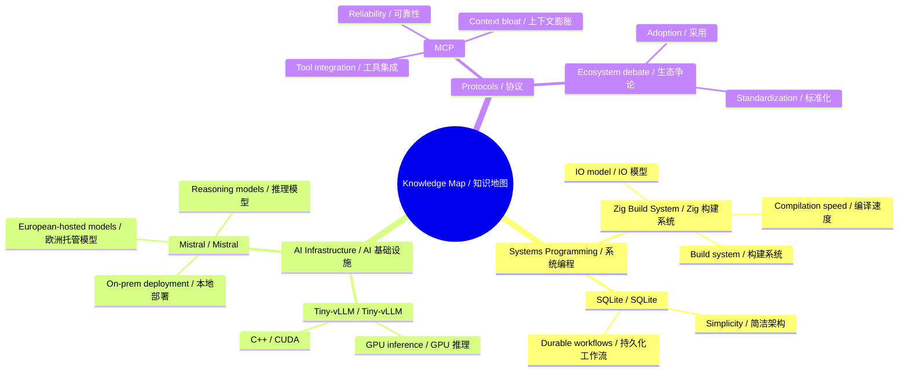

### Trade-offs / 取舍

- Speed vs. reliability / 速度 vs. 可靠性
- On-prem control vs. cloud convenience / 本地控制 vs. 云端便利
- Standardization vs. complexity / 标准化 vs. 复杂度
- Performance vs. repairability / 性能 vs. 可维修性
- Data quantity vs. interoperability / 数据数量 vs. 互操作性

## Overview chart / 总览图

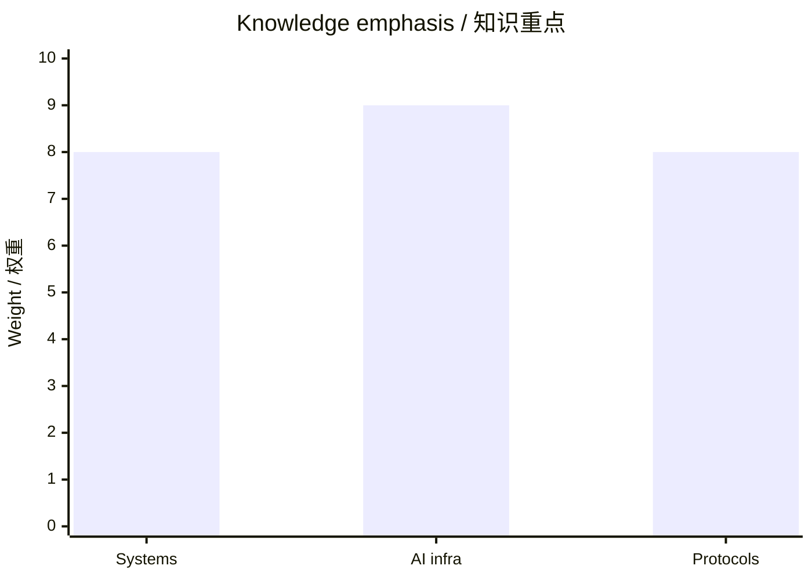

## Zig Build System Reworked for Faster Compilation ⭐️ 8.0/10

Zig's build system has been reworked, as detailed in the official devlog, resulting in improved compilation times and a better developer experience. This rework significantly enhances Zig's usability as a systems programming language, making it more competitive with other languages like Rust and C. Faster compilation times directly benefit developers working on large projects. The rework is part of the Zig 0.16.0 release, which also introduced a new IO mechanism that supports efficient single-threaded, multi-threaded, and event-loop implementations.

Zig 的构建系统已重写，根据官方开发日志，编译时间得到改善，开发者体验也更好。 此次重写显著提升了 Zig 作为系统编程语言的可用性，使其在与 Rust 和 C 等其他语言的竞争中更具优势。更快的编译时间直接惠及大型项目的开发者。 此次重写是 Zig 0.16.0 版本的一部分，该版本还引入了新的 IO 机制，支持高效的单线程、多线程和事件循环实现。

**Knowledge category / 知识分类**: Systems Programming / 系统编程

**Background**: Zig is a modern systems programming language focused on simplicity, performance, and safety. Its build system is responsible for compiling and linking code, and a well-designed build system is crucial for developer productivity.

**背景**: Zig 是一种现代系统编程语言，专注于简洁性、性能和安全性。其构建系统负责编译和链接代码，设计良好的构建系统对开发者生产力至关重要。

**Discussion**: Community members expressed positive experiences with Zig 0.16.0, praising the new IO mechanism and improved compilation times. Some users compared Zig favorably to other languages, while one user asked why they should choose Zig over Node.js and TypeScript.

**社区讨论**: 社区成员对 Zig 0.16.0 表达了积极体验，称赞新的 IO 机制和改进的编译时间。一些用户将 Zig 与其他语言进行了有利比较，而一位用户则询问为何应选择 Zig 而非 Node.js 和 TypeScript。

**Tags**: `#Zig`, `#build system`, `#programming languages`, `#compilation`

---

**标签**: `#Zig`, `#build system`, `#programming languages`, `#compilation`

---

### 你应该记住的 3 个知识点 / 3 things to remember

1. Zig's build system has been reworked, as detailed in the official devlog, resulting in improved compilation times and a better developer experience.
   - Zig 的构建系统已重写，根据官方开发日志，编译时间得到改善，开发者体验也更好。
2. Focus on build speed, runtime efficiency, and developer ergonomics.
   - 重点看构建速度、运行效率和开发者体验。
3. Ask what trade-off the tool is making.
   - 留意它在做什么取舍。

### Learning visuals / 学习图表

#### Comparison table / 对比图

| Aspect / 方面 | English / 英文 | 中文 / Chinese |
|---|---|---|
| What changed / 发生了什么 | Zig's build system has been reworked, as detailed in the official devlog, resulting in improved compilation ti… | Zig 的构建系统已重写，根据官方开发日志，编译时间得到改善，开发者体验也更好。 此次重写显著提升了 Zig 作为系统编程语言的可用性，使其在与 Rust 和 C 等其他语言的竞争中更具优势。更快的编译时间直接惠及大型项… |
| Why it matters / 为什么重要 | Systems Programming / 系统编程 | Systems Programming / 系统编程 |
| Trade-off / 取舍 | Speed, adoption, or simplicity | 速度、采用率或简洁性 |

#### Relationship map / 关系图

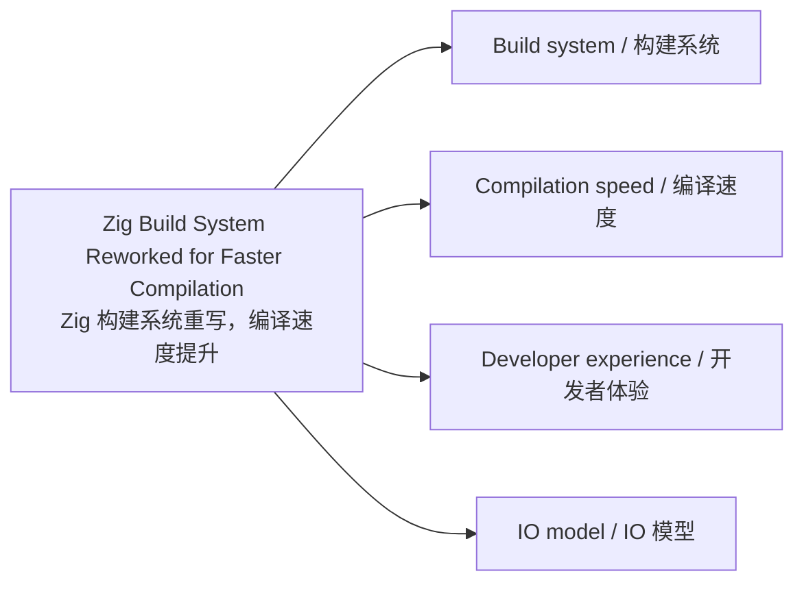

#### Impact chart / 影响力图

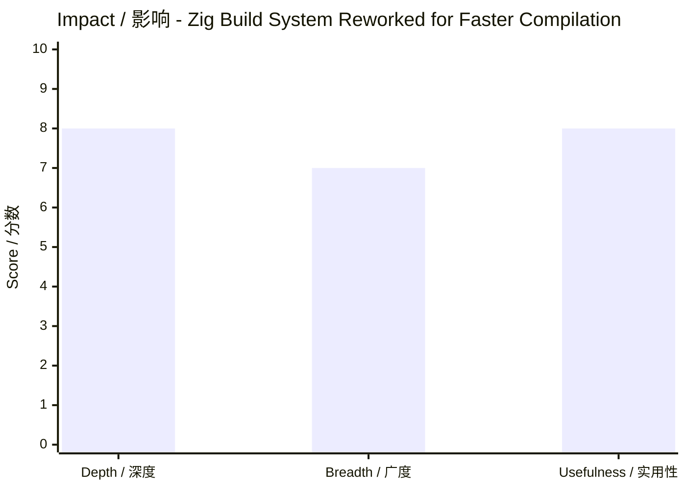

#### Study priority / 学习优先级图

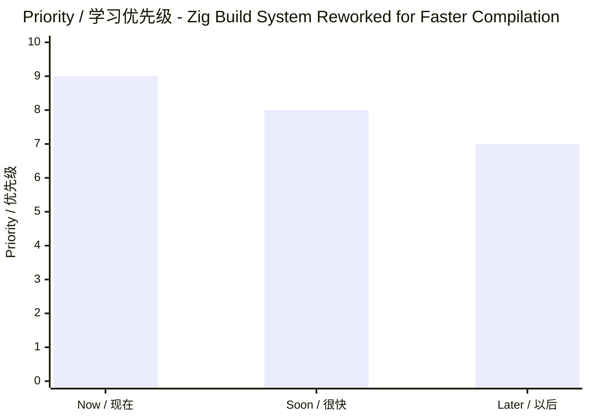

## Mistral AI Summit: On-Prem Focus vs. Reasoning Lag ⭐️ 8.0/10

At the Mistral AI Now Summit, Mistral emphasized its strategy of offering on-premise and European-hosted models for regulated industries, while community observers noted that Mistral has fallen behind in reasoning models compared to competitors like DeepSeek and Qwen. This matters because Mistral's focus on on-prem and European-hosted models provides a crucial alternative for European companies in regulated industries that cannot use US hyperscalers, but its technological lag in reasoning models could undermine its long-term competitiveness. Mistral's on-prem deployments include BNP Paribas using Mistral models for KYC in Belgium and Abanca using agent orchestration for 2 million customers. However, critics point out that Mistral's 120B-parameter 'small' model is 4x larger than competing small models yet underperforms them, and Mistral has only recently launched its first reasoning model, Magistral.

在 Mistral AI Now 峰会上，Mistral 强调了其为受监管行业提供本地部署和欧洲托管模型的战略，而社区观察者指出，与 DeepSeek 和 Qwen 等竞争对手相比，Mistral 在推理模型方面已经落后。 这很重要，因为 Mistral 专注于本地部署和欧洲托管模型，为受监管行业的欧洲公司提供了关键替代方案，使其无需依赖美国超大规模云服务商，但其在推理模型方面的技术滞后可能削弱其长期竞争力。 Mistral 的本地部署案例包括法国巴黎银行在比利时使用 Mistral 模型进行 KYC，以及 Abanca 使用智能体编排服务 200 万客户。然而，批评者指出，Mistral 的 120B 参数“小”模型比竞争对手的小模型大 4 倍，但性能却不如它们，且 Mistral 直到最近才推出其首个推理模型 Magistral。

**Knowledge category / 知识分类**: AI Infrastructure / AI 基础设施

**Background**: Mistral AI is a French AI startup known for its open-weight models and focus on European sovereignty. On-premise deployment allows enterprises to run AI models on their own infrastructure, keeping sensitive data within their walls, which is critical for regulated industries like banking and government. Reasoning models are a new class of AI that can perform step-by-step logical reasoning, exemplified by OpenAI's o1 and DeepSeek's R1.

**背景**: Mistral AI 是一家法国 AI 初创公司，以其开放权重模型和对欧洲主权的关注而闻名。本地部署允许企业在自己的基础设施上运行 AI 模型，将敏感数据保留在内部，这对于银行和政府等受监管行业至关重要。推理模型是一类新型 AI，能够执行逐步逻辑推理，例如 OpenAI 的 o1 和 DeepSeek 的 R1。

**Discussion**: Community sentiment is mixed: some users like simonw praise Mistral's on-prem strategy for regulated industries, while others like antirez and trouve_search express concern that Mistral is accumulating technological delay, especially in reasoning models, and that Chinese labs are outperforming them. A government IT person noted that Mistral is often the only EU-based option but is 'really bad and falling more behind.'

**社区讨论**: 社区情绪复杂：一些用户如 simonw 称赞 Mistral 针对受监管行业的本地部署策略，而另一些用户如 antirez 和 trouve_search 则担心 Mistral 在推理模型方面积累技术滞后，中国实验室的表现更优。一位政府 IT 人士指出，Mistral 通常是唯一基于欧盟的选择，但“真的很差，且落后更多”。

**Tags**: `#Mistral AI`, `#AI models`, `#on-premise`, `#European tech`, `#regulated industries`

---

**标签**: `#Mistral AI`, `#AI models`, `#on-premise`, `#European tech`, `#regulated industries`

---

### 你应该记住的 3 个知识点 / 3 things to remember

1. At the Mistral AI Now Summit, Mistral emphasized its strategy of offering on-premise and European-hosted models for regulated industries, while community observers noted that Mistral has fallen behind in reasoning models compared to competitors like DeepSeek and Qwen.
   - 在 Mistral AI Now 峰会上，Mistral 强调了其为受监管行业提供本地部署和欧洲托管模型的战略，而社区观察者指出，与 DeepSeek 和 Qwen 等竞争对手相比，Mistral 在推理模型方面已经落后。
2. Check deployment mode, inference quality, and cost control.
   - 关注部署方式、推理质量和成本控制。
3. Look for enterprise constraints such as privacy or sovereignty.
   - 注意企业约束，比如隐私或数据主权。

### Learning visuals / 学习图表

#### Comparison table / 对比图

| Aspect / 方面 | English / 英文 | 中文 / Chinese |
|---|---|---|
| What changed / 发生了什么 | At the Mistral AI Now Summit, Mistral emphasized its strategy of offering on-premise and European-hosted model… | 在 Mistral AI Now 峰会上，Mistral 强调了其为受监管行业提供本地部署和欧洲托管模型的战略，而社区观察者指出，与 DeepSeek 和 Qwen 等竞争对手相比，Mistral 在推理模型方面已经落后… |
| Why it matters / 为什么重要 | AI Infrastructure / AI 基础设施 | AI Infrastructure / AI 基础设施 |
| Trade-off / 取舍 | Speed, adoption, or simplicity | 速度、采用率或简洁性 |

#### Relationship map / 关系图

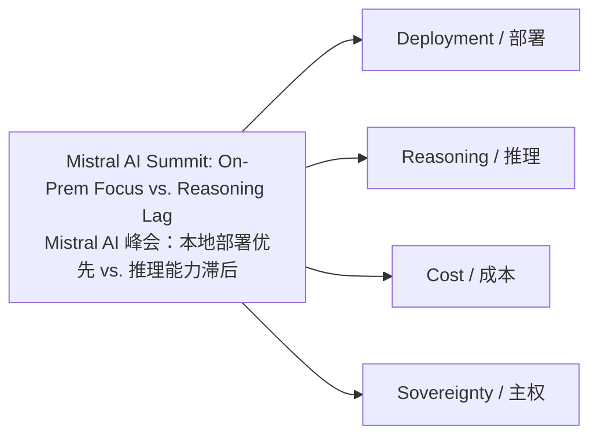

#### Impact chart / 影响力图

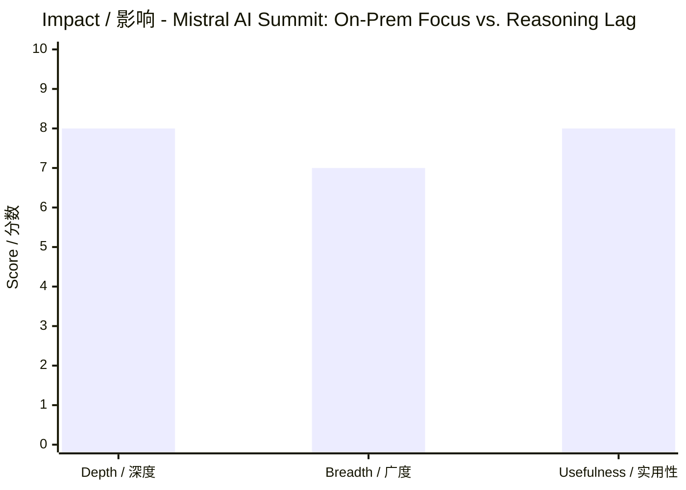

#### Study priority / 学习优先级图

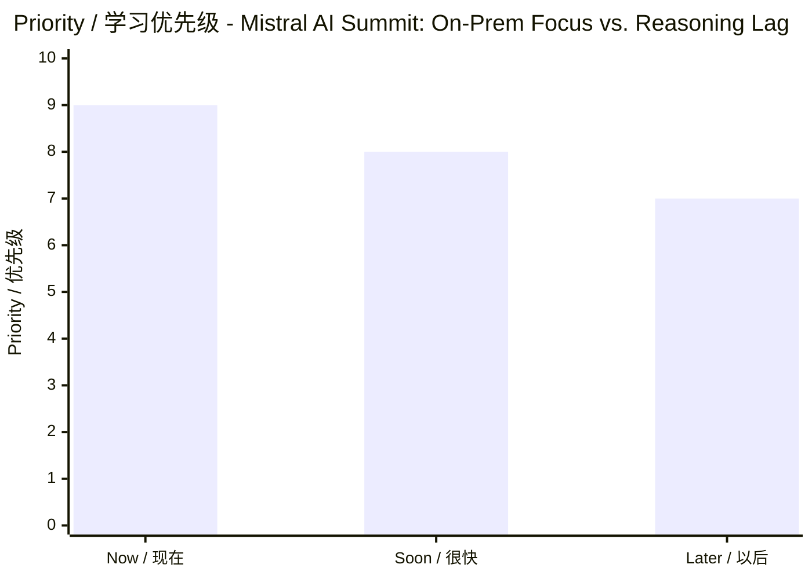

## MCP Is Dead? A Critical Analysis Sparks Debate ⭐️ 8.0/10

A blog post by Quandri argues that the Model Context Protocol (MCP) suffers from context window bloat and operational unreliability, declaring it effectively dead. The post has sparked a heated discussion, with an OpenAI team member countering that MCP's widespread adoption by companies building MCP servers proves its ongoing relevance. This debate highlights the growing pains of standardizing AI tooling protocols, which are critical for enabling LLMs to interact with external tools and data sources. The outcome could influence whether MCP remains the dominant standard or is replaced by alternatives. The author identifies two main problems: MCP consumes context window space by including all tool descriptions, and it relies on a client-server architecture that introduces operational unreliability. Community members note that MCP is essentially JSON RPC with extra fields, and that context bloat can be mitigated by on-demand documentation loading.

Quandri 的一篇博客文章指出，模型上下文协议（MCP）存在上下文窗口膨胀和操作不可靠等根本性缺陷，并宣称 MCP 已死。该文章引发了激烈讨论，OpenAI 团队成员反驳称，几乎所有公司都在构建 MCP 服务器，这证明了 MCP 的持续重要性。 这场争论凸显了 AI 工具协议标准化过程中的阵痛，而协议对于让 LLM 与外部工具和数据源交互至关重要。结果可能影响 MCP 是否继续作为主导标准，或被替代方案取代。 作者指出两个主要问题：MCP 通过包含所有工具描述来消耗上下文窗口空间，并且它依赖客户端-服务器架构，引入了操作不可靠性。社区成员指出，MCP 本质上是带有额外字段的 JSON RPC，并且可以通过按需加载文档来缓解上下文膨胀。

**Knowledge category / 知识分类**: Protocols & Tooling / 协议与工具

**Background**: The Model Context Protocol (MCP) is an open standard introduced by Anthropic in November 2024 to standardize how AI systems connect to external tools and data. It allows LLMs to interact with services like databases, search engines, and APIs through a unified interface. Context window bloat refers to the problem of filling an LLM's limited context with excessive tool descriptions, reducing its ability to process user requests.

**背景**: 模型上下文协议（MCP）是 Anthropic 于 2024 年 11 月推出的开放标准，旨在规范 AI 系统连接外部工具和数据的方式。它允许 LLM 通过统一接口与数据库、搜索引擎和 API 等服务交互。上下文窗口膨胀是指用过多的工具描述填满 LLM 有限的上下文，从而降低其处理用户请求的能力。

**Discussion**: The community is divided: some agree with the critique, citing practical issues like context bloat and reliability, while others argue that MCP's simplicity and widespread adoption make it valuable. An OpenAI team member emphasizes that the protocol's success is driven by ecosystem adoption, not technical perfection. Some commenters compare the debate to premature declarations of death for other technologies.

**社区讨论**: 社区意见分歧：一些人同意批评意见，指出上下文膨胀和可靠性等实际问题；另一些人则认为 MCP 的简单性和广泛采用使其有价值。一位 OpenAI 团队成员强调，该协议的成功是由生态系统采用驱动的，而非技术完美。一些评论者将这场争论比作对其他技术的过早死亡宣告。

**Tags**: `#MCP`, `#AI`, `#protocols`, `#LLM`, `#tooling`

---

**标签**: `#MCP`, `#AI`, `#protocols`, `#LLM`, `#tooling`

---

### 你应该记住的 3 个知识点 / 3 things to remember

1. A blog post by Quandri argues that the Model Context Protocol (MCP) suffers from context window bloat and operational unreliability, declaring it effectively dead.
   - Quandri 的一篇博客文章指出，模型上下文协议（MCP）存在上下文窗口膨胀和操作不可靠等根本性缺陷，并宣称 MCP 已死。该文章引发了激烈讨论，OpenAI 团队成员反驳称，几乎所有公司都在构建 MCP 服务器，这证明了 MCP 的持续重要性。
2. Think about integration simplicity versus operational overhead.
   - 思考集成简洁性和运维开销之间的平衡。
3. Notice whether the protocol solves a real workflow pain point.
   - 判断这个协议是否真的解决了实际工作流痛点。

### Learning visuals / 学习图表

#### Comparison table / 对比图

| Aspect / 方面 | English / 英文 | 中文 / Chinese |
|---|---|---|
| What changed / 发生了什么 | A blog post by Quandri argues that the Model Context Protocol (MCP) suffers from context window bloat and oper… | Quandri 的一篇博客文章指出，模型上下文协议（MCP）存在上下文窗口膨胀和操作不可靠等根本性缺陷，并宣称 MCP 已死。该文章引发了激烈讨论，OpenAI 团队成员反驳称，几乎所有公司都在构建 MCP 服务器，这证… |
| Why it matters / 为什么重要 | Protocols & Tooling / 协议与工具 | Protocols & Tooling / 协议与工具 |
| Trade-off / 取舍 | Speed, adoption, or simplicity | 速度、采用率或简洁性 |

#### Relationship map / 关系图

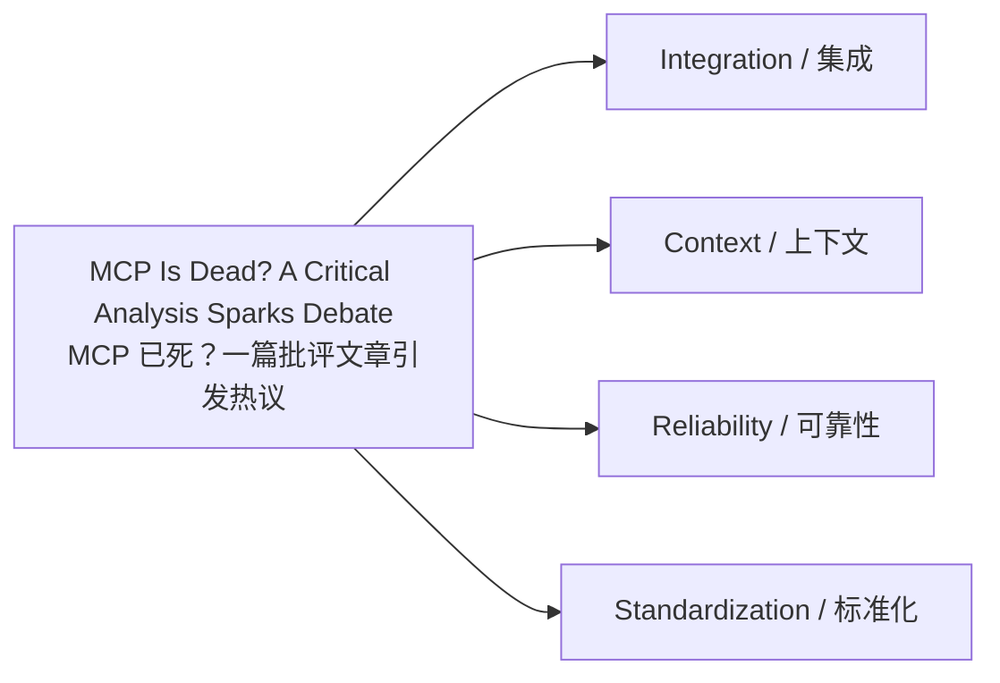

#### Impact chart / 影响力图

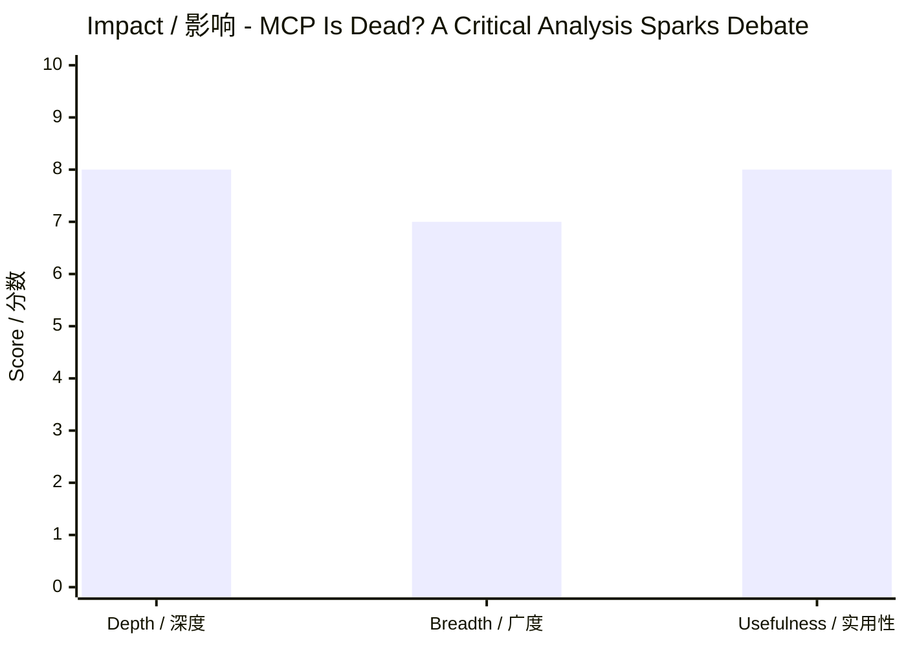

#### Study priority / 学习优先级图

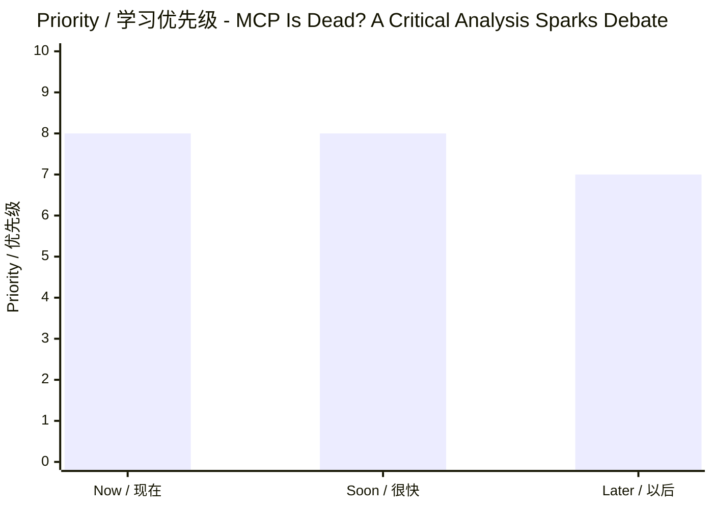

